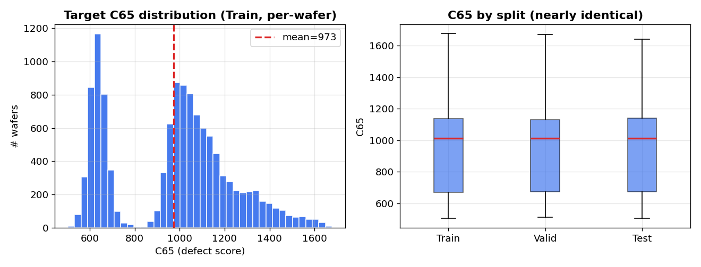
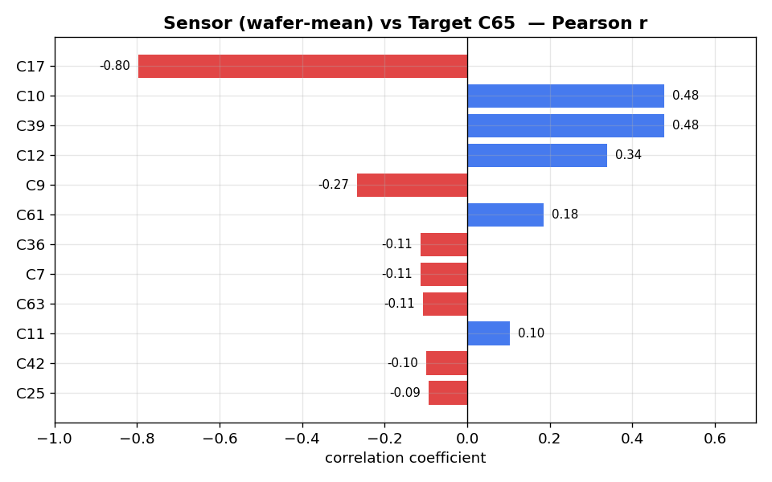
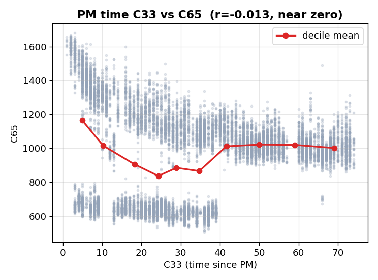
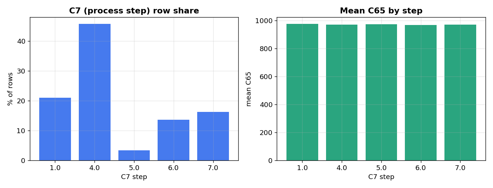

# 01_EDA 분석 결과 보고서

> **프로젝트**: SK하이닉스 반도체 결함 예측 (FDC Trace 데이터 → C65 회귀)
> **문서 성격**: 탐색적 데이터 분석(EDA) 결과 보고서
> **목적**: 모델을 만들기 전에 데이터의 성질을 파악하고, "어떤 컬럼을 피처로 쓸지 / 어떻게 예측할지"의 근거를 확보한다
> **작성 기준**: `01_EDA.ipynb` 실행 결과 + 본 보고서용 재검증 스크립트

---

## 0. 데이터 개요

### 0.1 데이터 규모

| 구분 | 행(Row) 수 | 컬럼 수 | 웨이퍼(WF) 수 |
|------|-----------|--------|-------------|
| Train (학습용) | 123,614 | 65 | 11,939 |
| Valid (검증용) | 20,577 | 64 | 1,990 |
| Test (평가용) | 20,510 | 64 | 1,990 |

- 한 행(row)은 **"웨이퍼 1장이 공정의 한 단계(Step)를 지날 때 센서가 남긴 기록"** 입니다.
- 웨이퍼 1장은 여러 단계를 거치므로, **같은 C64를 가진 행이 평균 약 10개** 존재합니다.
- Valid/Test에는 정답 컬럼(C65)이 빠져 있어 컬럼이 하나 적습니다. 정답은 별도 파일(`문제1_하_answer/`)로 제공됩니다.

### 0.2 데이터 수집 기간

| 구분 | 시작 | 종료 |
|------|------|------|
| Train | 2018-12-01 00:44 | 2019-02-08 09:43 |
| Valid | 2018-12-01 00:46 | 2019-02-08 09:41 |
| Test | 2018-12-01 00:57 | 2019-02-08 09:35 |

세 데이터셋 모두 **같은 2개월(2018.12 ~ 2019.02)** 을 포괄합니다. 시간 순으로 자른 것이 아니라 같은 기간에서 무작위로 나눈 것으로 보입니다 → 시간 흐름에 따른 분포 변화(temporal drift)를 걱정할 필요가 적습니다.

---

## 1. 컬럼 점검 — 어떤 컬럼을 버릴 것인가

모델에 넣기 전, 65개 원본 컬럼을 하나씩 점검해 "정보가 없는 컬럼"을 걸러냈습니다.

### 1.1 전부 비어있는 컬럼 (8개)
```
C2, C13, C26, C37, C43, C47, C53, C55
```
데이터가 하나도 없어(전부 결측) 아무 정보가 없습니다 → **즉시 제거.**

### 1.2 상수 컬럼 (모든 행이 같은 값, 20개)
```
C2, C3, C8, C13, C14, C19, C21, C24, C26, C28,
C29, C30, C37, C43, C44, C45, C47, C51, C53, C55
```
모든 행이 똑같은 값을 가지면 웨이퍼를 구분하는 데 전혀 쓸모가 없습니다 → **제거.** (예: 모든 학생의 키가 같다면 키로는 성적을 예측할 수 없음)

### 1.3 식별자·명세 제외 컬럼

| 컬럼 | 정체 | 제외 이유 |
|------|------|-----------|
| C20, C21, C22 | Lot ID (생산 묶음 번호) | 새 데이터엔 처음 보는 번호가 나옴 → **일반화 불가** |
| C34, C35, C38 | 웨이퍼 식별자 | C64와 중복되는 ID, 물리적 의미 없음 |
| C64 | 웨이퍼 ID | 피처로는 안 쓰고 **그룹키**로만 사용 |
| C26, C28, C29, C37 | 명세상 제외 지정 | 문제 명세에서 사용 금지 |

### 1.4 결측 패턴
- **부분 결측 컬럼: 0개.** 전부 결측(8개)을 제외하면 빈칸이 전혀 없습니다.
- **해석**: 데이터 품질이 매우 우수합니다. 빈칸을 채우는(imputation) 별도 작업이 필요 없습니다.

> **조치 결론**: 원본 65개 → 정보 없는 컬럼 제거 후, 물리적 의미가 있는 **FDC 센서 수치형 37개 + 범주형(C6, C7) + 시간/PM(C33) + Recipe(C23)** 만 피처 후보로 남깁니다.

---

## 2. 웨이퍼(WF) 그룹 구조 — 왜 "웨이퍼 단위"로 예측하는가

### 2.1 웨이퍼당 행 수

| 항목 | 값 |
|------|---|
| 최소 | 9행 |
| 중앙값 | 10행 |
| 최대 | 24행 |
| 표준편차 | 1.12 |

대부분의 웨이퍼가 약 10개 행(=공정 단계)을 가지며, 편차가 작아 구조가 균일합니다.

### 2.2 C65는 웨이퍼 내 상수

- **같은 웨이퍼 안에서 C65 값은 항상 동일** (검증 결과: True).
- 즉 결함 수치는 웨이퍼 1장당 하나로 정해지는 값입니다.

### 2.3 그래서 어떻게?

> C65가 웨이퍼 단위 값이므로, **여러 행(공정 단계)의 센서값을 평균·최대·최소 등으로 요약(집계)해 "웨이퍼 1장 = 1행"으로 만든 뒤** 예측하는 전략이 자연스럽습니다. (이 집계 방식이 이후 모델링의 뼈대가 됩니다.)

---

## 3. 예측 대상(C65) 분포



*왼쪽: Train 웨이퍼별 C65 히스토그램(빨간 점선 = 평균 973). 오른쪽: Train/Valid/Test 세 데이터셋의 C65 상자그림 — 거의 동일합니다.*

### 3.1 기초 통계

| 통계량 | Train | Valid | Test |
|--------|-------|-------|------|
| 평균 | 973.2 | 973.3 | 977.9 |
| 표준편차 | 261.7 | 259.0 | 262.0 |
| 최솟값 | 503 | 511 | 503 |
| 중앙값 | 1,012 | 1,014 | 1,014 |
| 최댓값 | 1,678 | 1,672 | 1,643 |
| 왜도(치우침) | 0.05 | 0.07 | 0.03 |
| 첨도 | -0.80 | -0.68 | -0.82 |

### 3.2 해석
- **평균 약 973**으로 세 데이터셋이 거의 동일 → 학습 데이터와 시험 데이터의 정답 분포가 같습니다(좋은 신호).
- **왜도 ≈ 0**: 좌우 대칭에 가깝습니다. 한쪽으로 쏠리지 않았습니다.
- **첨도 ≈ -0.8**: 정규분포보다 약간 납작합니다(값이 500~1,700에 고르게 퍼짐).

### 3.3 조치
> 왜도가 0에 가까우므로 **로그 변환 등 타깃 변환은 불필요**합니다. C65를 그대로 예측하면 됩니다.

---

## 4. 데이터 분포 일관성 — 학습과 시험이 같은 문제인가

머신러닝의 대전제는 "학습할 때 본 데이터와 시험 데이터의 성질이 같다"는 것입니다. 이를 **Adversarial Validation**으로 검증했습니다. "이 행이 Train인지 Test인지 맞혀봐"라는 분류기를 만들어, 그 정확도(AUC)를 봅니다.

| 비교 | AUC | 해석 |
|------|-----|------|
| Train vs Valid | 0.5103 | 구분 불가 = 분포 동일 |
| Train vs Test | 0.5008 | 구분 불가 = 분포 동일 |
| Valid vs Test | 0.4970 | 구분 불가 = 분포 동일 |

> **AUC 0.5 = 동전 던지기 수준 = "구분할 수 없다" = "분포가 같다".** 세 데이터셋이 사실상 같은 성질이므로, 도메인 적응 같은 특수 기법 없이 표준 파이프라인을 그대로 써도 안전합니다.

---

## 5. 센서와 결함의 관계 — 어떤 컬럼이 예측에 중요한가

각 센서(웨이퍼 평균)와 C65의 **피어슨 상관계수**(직선 관계의 강도, -1~+1)를 계산했습니다. 이 보고서용 재검증 스크립트에서도 아래 값이 그대로 재현되었습니다.



*빨강 = 음의 상관(센서↑ 시 결함↓), 파랑 = 양의 상관. C17이 -0.80으로 압도적입니다.*

| 피처 | 상관계수 | 의미 |
|------|---------|------|
| **C17** | **-0.797** | 매우 강한 음의 상관 (C17↑ → C65↓). 단일 최강 예측 변수 |
| **C10** | **+0.478** | 중간 양의 상관 (시간 관련 변수) |
| **C39** | **+0.478** | C10과 동일 값 → 사실상 같은 정보 |
| **C12** | **+0.338** | 약한 양의 상관 |
| C9 | -0.267 | 약한 음의 상관 |
| C61 | +0.185 | 약함 |

### 해석
- **C17이 결함을 가장 잘 설명하는 센서**입니다(상관 -0.80은 현업 데이터에서 매우 높은 편).
- C10과 C39는 상관계수가 완전히 같아 **거의 같은 정보를 담은 중복 변수**입니다(둘 다 시간 관련). → 트리 모델은 중복에 강하므로 일단 유지하되, 하나로 봐도 무방합니다.
- 강한 상관을 보이는 피처가 소수(C17 하나가 압도)라, **직선 모델보다 비선형 모델(LightGBM 등)** 이 나머지 약한 신호까지 조합하기에 유리합니다.

> ⚠️ **참고 (상관 ≠ 모델 중요도)**: 위는 "직선 관계"만 보는 상관계수입니다. 실제 트리 모델이 학습 후 매기는 **피처 중요도**는 조금 다릅니다(모델링 단계에서 C10·C33 같은 변수가 값을 잘게 쪼개 쓰기 좋아 상위로 올라옴). 두 지표는 서로 다른 것을 측정하므로, 상관이 낮아도 모델엔 유용할 수 있습니다.

---

## 6. PM(예방 정비, C33)의 영향

C33은 장비를 정비(PM)한 뒤 지난 시간입니다. 정비 직후와 오래된 장비가 결함에 차이를 줄까요?



*회색 점 = 웨이퍼별, 빨간 선 = C33 10구간 평균. 선이 거의 평평합니다 → 직선적 영향 없음.*

- **C33 ↔ C65 상관계수: -0.013** (사실상 0).
- **해석**: PM 경과시간과 결함의 **직선적** 관계는 없습니다. 다만 "정비 직후엔 좋다가 특정 시점 급변" 같은 비선형 패턴 가능성은 남으므로, 트리 모델의 피처로는 포함하되 큰 기대는 하지 않습니다.

---

## 7. 범주형 변수 (C6 레시피, C7 공정단계)

### 7.1 C6 (Recipe, 2종)

| C6 값 | Train | Valid | Test |
|-------|-------|-------|------|
| C6_0 | 99.2% | 99.1% | 99.5% |
| C6_1 | 0.8% | 0.9% | 0.5% |

C6_0이 99% 이상 → **사실상 상수에 가까움.** 정보량이 거의 없습니다. (이 발견은 뒤에 v5에서 "진짜 변동하는 레시피 C23을 대신 써야 한다"는 결정으로 이어집니다.)

### 7.2 C7 (Step, 5종)



*왼쪽: 각 단계의 행 비중(Step 4가 46%로 최다). 오른쪽: 단계별 평균 C65.*

| C7 값 | 행 비중 |
|-------|---------|
| 1 | 21.0% |
| 4 | 45.8% |
| 5 | 3.4% |
| 6 | 13.6% |
| 7 | 16.2% |

- C7은 5개 단계(1,4,5,6,7)로 구성되며 Step 4가 최다입니다.
- 세 데이터셋 간 분포가 동일 → 분포 변화 없음 재확인.
- **조치**: C7은 공정 단계라는 물리적 의미가 있어 피처로 사용합니다.

---

## 8. 이상치(극단값)

| 항목 | 값 |
|------|---|
| C65 정상범위(IQR 기준) | [-30.8, 1,839.2] |
| C65 이상치 개수 | **0개** / 11,939 (0.00%) |

실제 데이터 범위(503~1,678)가 정상범위 안에 완전히 들어갑니다 → **타깃에 이상치가 없어** 클리핑/제거 불필요. 센서 피처의 이상치는 트리 모델이 자동 처리하므로 별도 조치 없이 진행합니다.

---

## 9. 종합 진단 및 모델링 방향

### 9.1 데이터 품질: 우수

| 항목 | 평가 | 근거 |
|------|------|------|
| 결측값 | 양호 | 부분 결측 0개 |
| 분포 일관성 | 매우 양호 | Adversarial AUC ≈ 0.50 |
| 이상치 | 양호 | C65 이상치 0개 |
| 타깃 분포 | 양호 | 대칭적, 변환 불필요 |

### 9.2 핵심 발견 5가지

1. **C17이 단일 최강 예측 변수** (상관 -0.797).
2. Train/Valid/Test **분포가 동일** → 표준 학습 파이프라인으로 충분.
3. 웨이퍼당 약 10행, **C65는 웨이퍼 단위 상수** → 웨이퍼 단위 집계 후 예측.
4. **정보 없는 컬럼 다수 제거** 필요(전부결측 8 + 상수 20 + 식별자/제외).
5. C6는 99% 상수라 무의미, **PM(C33)의 직접 영향도 미미**(r=-0.013).

### 9.3 권장 전처리·모델링 파이프라인
```
1. 정보 없는 컬럼 제거 (전부결측·상수·Lot ID·중복 식별자)
2. 웨이퍼(C64) 단위로 센서 집계 (mean/std/min/max/median/range/delta/slope)
3. C65 변환 불필요 (왜도 ≈ 0), 결측 처리 불필요
4. C6(약함)·C7(단계)·C33(PM) 포함, C17/C10/C12를 핵심 피처로 주목
5. 모델: 트리 기반(LightGBM) 우선 — 비선형·다중공선성에 강함
6. 검증: GroupKFold(C64) — 같은 웨이퍼가 학습·검증에 섞이지 않게 (누수 방지)
```

이 방향이 이후 `modeling_baseline` → `v2~v6` 실험의 출발점이 됩니다. 결과 요약은 프로젝트 루트의 `REPORT.md`를 참조하세요.

---

## 부록: 이 보고서의 그래프는 어떻게 만들었나

`assets/` 폴더의 그래프는 원본 `train_data.csv`와 정답 파일을 그대로 불러와 재계산한 것입니다. 상관계수(C17 -0.797, C10/C39 0.478, C33 -0.013)가 원 노트북 결과와 정확히 일치함을 확인했습니다 — 즉 본 보고서의 수치는 재현 가능한 실제 값입니다.
