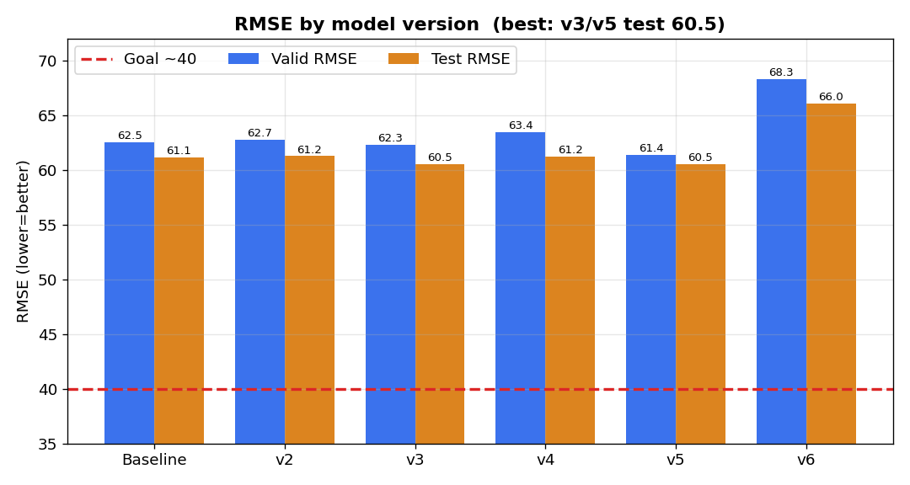

# SK하이닉스 반도체 불량 예측 — 종합 분석 보고서

> **과제**: FDC Trace 센서 데이터 → 웨이퍼별 결함 수치(C65) 회귀 예측 (난이도 下)
> **평가 지표**: RMSE (Root Mean Squared Error, 낮을수록 좋음)
> **최종 성능**: **Test RMSE 60.5** (베이스라인 평균예측 259 대비 4.3배 개선) / 목표 40
> **주력 모델**: LightGBM (Gradient Boosted Decision Trees) + GroupKFold(C64) 5-Fold
> **작성 기준**: EDA + baseline~v6 실험 결과 종합, 본 보고서용 재검증 그래프 포함

---

## 이 보고서를 읽는 법 (비전공자용)

반도체 공장의 장비 센서 기록만 보고, 실제 검사 전에 **"이 웨이퍼가 얼마나 불량일지"** 를 숫자로 예측하는 프로젝트입니다. 요리에 비유하면, 오븐 온도·시간·재료 상태 기록만 보고 "이 빵이 얼마나 잘 구워질지" 점수를 매기는 것과 같습니다.

이 문서는 프로젝트 **전체 결과 요약본**입니다. 순서는 ① 데이터 → ② 어떤 피처를 왜 만들었나 → ③ 피처가 실제로 유효한지 검증 → ④ 어떤 모델을 왜 골랐나 → ⑤ 모델 성능과 그래프 해석 → ⑥ 오차의 정체와 한계 → ⑦ 다음 계획 입니다. 각 실험(버전)의 상세는 `modeling_v*/` 폴더의 개별 보고서에 있습니다.

**핵심 결론 한 줄**: 센서를 웨이퍼 단위로 요약해 트리 모델에 넣는 방식으로 **RMSE 60.5**(정답 분산의 94.7%를 설명, R²=0.947)에 도달했으나, 이 접근법 자체의 천장이 ~60이라 목표 40에는 특정 구간의 "놓친 신호"를 더 잡아야 합니다.

---

## 1. 데이터 개요

| 구분 | 용도 | 행 수 | 웨이퍼 수 |
|------|------|-------|-----------|
| **train_data.csv** | 모델 학습 (정답 포함) | 123,614 | 11,939 |
| **valid_X.csv** | 검증 (리더보드) | 20,577 | 1,990 |
| **test_X.csv** | 최종 평가 | 20,510 | 1,990 |

- 한 행 = **웨이퍼 1장이 공정 한 단계(C7)를 지날 때의 센서 기록.** 웨이퍼당 평균 약 10행.
- **C65(정답)는 웨이퍼 내에서 항상 같은 값** → 예측은 **웨이퍼 단위(1 WF = 1 예측)** 로 수행.
- EDA 결과 데이터 품질 우수: 부분 결측 0개, C65 이상치 0개, Train/Valid/Test 분포 동일(Adversarial AUC ≈ 0.50). 상세는 `EDA/01_EDA_REPORT.md`.

---

## 2. 피처(예측 입력 변수) — 원본 컬럼에서 무엇을 어떻게 만들었나

### 2.1 원본 컬럼의 역할 분류

원본 65개 컬럼을 물리적 의미에 따라 분류하고, **"새 데이터에도 일반화되는 물리량"만** 피처로 채택했습니다.

| 원본 컬럼 | 역할 | 피처로 사용? | 이유 |
|-----------|------|:---:|------|
| FDC 센서 수치형 37개 (C1, C4, C5, C9, C11, C12, C15~C18, …) | 온도·압력·유량 등 | ✅ | 공정 물리량, 결함과 직결 |
| C6 | Recipe(2종) | △ | 99% 상수라 정보 적음 |
| C23 | Recipe(28종) | ✅ (v5~) | 실제 변동, 일반화 안전 |
| C7 | Step(공정단계) | ✅ | 단계별 센서 의미 다름 |
| C10, C39 | 시간(타임스탬프) | ✅ | 시간 파생/집계 |
| C33 | PM(정비) 경과시간 | ✅ | 장비 열화 지표 |
| C64 | 웨이퍼 ID | 🔑 그룹키 | 피처 아님(누수 방지) |
| C20/C21/C22 (Lot ID) | 생산 묶음 번호 | ❌ | 새 데이터엔 미관측 번호 → 일반화 불가 |
| C34/C35/C38 | 중복 웨이퍼 식별자 | ❌ | 물리 의미 없음 |
| 전부결측 8 + 상수 20 | — | ❌ | 정보 없음 |
| **C65** | **결함 수치** | 🎯 타깃 | 예측 목표 |

> **설계 원칙**: Lot ID·웨이퍼 ID를 피처로 쓰면 학습 데이터에선 점수가 오르지만, 현업 신규 데이터엔 처음 보는 번호가 나와 무너집니다. 그래서 **물리적 의미가 있는 센서·레시피·단계·시간·PM만** 사용합니다.

### 2.2 웨이퍼 단위 집계 피처 (핵심)

원본은 "웨이퍼 1장 = 여러 행"입니다. 이를 **"웨이퍼 1장 = 1행"** 으로 요약하기 위해, 각 센서마다 8종 통계량을 계산했습니다.

| 통계량 | 의미 | 공정 관점 비유 |
|--------|------|----------------|
| mean(평균) | 공정 내내 평균 수준 | 하루 평균 기온 |
| std(표준편차) | 값이 얼마나 흔들렸나 | 기온 변동폭 |
| min / max | 최저·최고값 | 최저·최고 기온 |
| median(중앙값) | 이상치에 강한 대표값 | 체감 온도 |
| range(범위=max-min) | 전체 변동폭 | 일교차 |
| delta(끝-처음) | 공정 순변화량 | 오늘 vs 어제 기온 |
| slope(기울기) | 시간에 따른 추세 | 계속 오르는 추세인지 |

추가 메타 피처: **n_rows**(공정 단계 수), **C41_total**(총 소요시간), **C33_first/max**(PM 경과), **C6·C7 비율**(레시피·단계 구성비). → baseline 기준 약 **300개 피처**.

---

## 3. 피처 검증 — 만든 피처가 실제로 유효한가

### 3.1 상관 검증: 어떤 센서가 결함과 관련 있나


*센서(웨이퍼 평균)와 C65의 피어슨 상관. C17이 -0.80으로 압도적.*

| 피처 | 상관계수 | 유효성 |
|------|---------|--------|
| **C17** | **-0.797** | 단일 최강 신호 — 반드시 포함 |
| C10 / C39 | +0.478 | 유효(시간). 단, 서로 중복 |
| C12 | +0.338 | 유효 |
| C9 | -0.267 | 보조 |
| C33 (PM) | -0.013 | 직접 신호 없음 → 비선형 기대만 |

**해석**: C17 하나가 결함의 상당 부분을 설명합니다. 강한 신호가 소수라, 여러 약한 신호를 조합하는 **비선형 트리 모델**이 유리하다는 근거가 됩니다.

### 3.2 모델 기반 검증: 트리가 실제로 무엇을 쓰나

상관계수는 "직선 관계"만 봅니다. 실제 학습된 LightGBM이 어떤 피처를 얼마나 쓰는지는 **피처 중요도(Feature Importance)** 로 확인합니다.


*재학습한 baseline LightGBM의 상위 15개 피처(gain 기준).*

**해석 (중요한 뉘앙스)**:
- 상관에서는 C17이 1위였지만, 트리 중요도에서는 **C10_mean(시간)·C33_slope(PM 추세)·C61·C12** 등이 상위입니다.
- 이유: 트리는 값을 **잘게 쪼개(split)** 쓰는데, 시간(C10)·PM(C33) 같은 연속·다양한 값은 쪼갤 지점이 많아 중요도가 높게 나옵니다. C17은 강하지만 한 번의 큰 분할로 소진됩니다.
- **결론**: 상관과 중요도가 다른 것은 정상이며, 둘 다 봐야 전체 그림이 보입니다. PM(C33)은 직접 상관은 0이지만 트리에선 **비선형 신호로 실제 기여**함이 확인됩니다 → 피처로 유지한 판단이 옳았습니다.

### 3.3 피처 추가 실험의 교훈 (v2·v4)

무작정 피처를 늘리면 좋아질까요? 실험으로 검증했습니다.

| 실험 | 피처 수 | Test RMSE | 결과 |
|------|--------|-----------|------|
| baseline | ~300 | 61.15 | 기준 |
| v2 (Step별 집계) | 816 | 61.25 | 악화 |
| v4 (교차·FFT·분포형태) | 901 | 61.19 | 악화 |

**해석**: 피처를 2.6~3배 늘려도 성능은 오히려 나빠졌습니다. 대부분이 노이즈였고, 웨이퍼당 행이 ~10개뿐이라 Step별 통계나 FFT가 의미 있는 정보를 만들지 못했습니다. → **"많은 피처 ≠ 좋은 피처"**, 물리적 근거가 있는 소수 피처가 낫습니다.

---

## 4. 모델 채택 사유 — 왜 LightGBM인가

### 4.1 후보 비교

| 모델 | 장점 | 이 데이터 적합성 | 채택 |
|------|------|------------------|:---:|
| 선형회귀 | 단순·해석 쉬움 | 강신호가 C17 하나뿐, 비선형 관계 못 잡음 | ❌ |
| **LightGBM (GBDT)** | 비선형·다중공선성·이상치에 강함, 표 데이터 최강, 빠름 | 표(tabular) 소표본에 최적 | ✅ **주력** |
| 딥러닝(1D-CNN/LSTM) | 시퀀스 패턴 학습 | 표본 1.2만은 부족, 시퀀스 짧음(~10) | ❌ (v6 실패) |

### 4.2 채택 근거

1. **데이터가 "표(tabular)" 형태**: 웨이퍼 1행 × 수백 피처. 이 영역은 GBDT가 딥러닝보다 우세한 것이 정설이며, 실제 v6 딥러닝이 +5.5pt 패배로 재확인.
2. **비선형·중복에 강함**: C10/C39 같은 중복, C17의 비선형 관계, 센서 이상치를 별도 전처리 없이 처리.
3. **표본이 작음(1.2만 웨이퍼)**: 딥러닝엔 부족하지만 GBDT엔 충분.

### 4.3 검증 설계: GroupKFold(C64)

- 학습 데이터를 5등분해 4개로 학습·1개로 검증을 5회 반복(교차검증).
- **핵심**: 같은 웨이퍼의 여러 행이 학습과 검증에 동시에 들어가면 점수가 부풀려집니다(data leakage). C64를 그룹키로 묶어 **한 웨이퍼는 통째로 한 쪽에만** 들어가게 했습니다.

### 4.4 하이퍼파라미터 (v3 Optuna 최적값)

| 파라미터 | 값 | 의미 |
|----------|-----|------|
| learning_rate | 0.0058 | 트리가 배우는 속도(작을수록 신중) |
| num_leaves | 189 | 트리 복잡도 |
| max_depth | 10 | 트리 최대 깊이 |
| colsample_bytree | 0.655 | 트리마다 피처 65%만 사용 |
| reg_alpha / lambda | 4.26 / 0.003 | 과적합 억제(정규화) |
| best_iteration | ~1,000 | 실제 학습된 트리 수 |

Optuna로 100회 자동 탐색한 값입니다. 단, 튜닝의 개선폭은 ~0.5pt로 작았습니다(7장 참고).

---

## 5. 모델 성능 결과

### 5.1 버전별 RMSE 종합



| 버전 | 접근 | CV OOF | Valid | Test | 판정 |
|------|------|--------|-------|------|------|
| 베이스라인(평균예측) | 전부 평균 | — | 258.97 | — | 기준점 |
| **baseline** | 기본 집계 + 수동 파라미터 | 62.88 | 62.53 | 61.15 | 출발선 |
| v2 | Step별 집계 추가 | 63.12 | 62.72 | 61.25 | 악화 |
| **v3** | Optuna 튜닝 | 62.19 | 62.31 | **60.51** | **최선(Test)** |
| v4 | 피처 대량 추가 | 63.09 | 63.42 | 61.19 | 악화 |
| **v5** | Row-level + C23 | 62.63 | **61.38** | 60.52 | 최선(Valid) |
| v6 | 딥러닝(1D-CNN) | 68.92 | 68.26 | 66.04 | 실패 |
| **목표** | — | — | ~40 | ~40 | 미달 |

**해석**:
- **평균만 찍는 것(RMSE 259) 대비 4.3배 개선**된 60.5가 최선입니다. 절대 성능은 이미 강력합니다.
- 하지만 baseline(61.2) → v3(60.5)까지 **여러 실험의 개선폭이 1pt 미만**입니다. 즉 "웨이퍼 집계 → 트리" 접근법이 **~60에서 천장**에 닿았습니다.
- 딥러닝(v6)은 오히려 크게 나빠져, 표본·시퀀스 한계를 확인하고 종료했습니다.

### 5.2 CV↔Valid 안정성

v3 기준 CV OOF 62.19 vs Valid 62.31로 **격차 0.12**에 불과합니다 → 과적합이 아니며, 교차검증 점수를 신뢰할 수 있습니다(격차가 크면 과적합 의심).

---

## 6. 모델 검증 그래프 — 예측이 얼마나 정확한가

### 6.1 실제값 vs 예측값 (산점도)


*Test 데이터, 최선 모델. 점이 빨간 대각선(완벽 예측)에 가까울수록 정확.*

- **R² = 0.947, 상관 0.973**: 정답 분산의 94.7%를 설명. 점들이 대각선을 따라 잘 정렬됩니다.
- 다만 양 끝이 대각선에서 안쪽으로 휘어 있습니다 → **극단값을 평균 쪽으로 당기는(shrinkage) 경향**. 낮은 값은 살짝 높게, 높은 값은 살짝 낮게 예측합니다.

### 6.2 오차의 정체 (10분위 편향 분석)

RMSE 60이 **어디서** 발생하는지, 정답 크기순 10구간으로 나눠 분석했습니다.


*왼쪽: 구간별 RMSE. 오른쪽: 편향(빨강=과대예측, 파랑=과소예측).*

| 정답 구간 | RMSE | 편향 | 진단 |
|-----------|------|------|------|
| 503~623 (최저) | 39.7 | +32.4 | 과대예측(수축) |
| 624~652 | 20.1 | +0.5 | 정확 |
| **742~976** | **78.8** | **+58.8** | **특정 regime 놓침** |
| … | | | |
| 1315~1643 (최고) | 89.0 | -39.9 | 과소예측(수축) |

**핵심 발견 2가지**:
1. **양극단 수축**: 아주 낮거나 높은 웨이퍼를 평균 쪽으로 당김 → 트리 회귀의 구조적 한계.
2. **742~976 구간의 +58.8 스파이크**: 단순 수축으로는 설명 안 되는 **비정상적 과대예측**. 이 구간의 웨이퍼들이 공유하는 어떤 특성(특정 레시피 C23_14/C23_12, 센서 임계 등)을 모델이 **놓치고 있다는 신호**입니다. → 목표 40 돌파의 유일한 열쇠일 가능성.

---

## 7. 한계와 진단

| 시도 | 결과 | 시사점 |
|------|------|--------|
| 피처 대량 추가(v2·v4) | 악화 | 무차별 피처는 노이즈만 증가 |
| 하이퍼파라미터 튜닝(v3) | +0.5pt | 튜닝 여지는 거의 소진 |
| Row-level + 데이터 재탐색(v5) | Valid 최선, Test 정체 | 표현력 한계 근접 |
| 딥러닝(v6) | +5.5pt 악화 | 소표본·짧은 시퀀스로 GBDT에 패배 |

> **종합 진단**: "웨이퍼 집계 → tabular 트리 모델" 프레임은 RMSE ~60이 천장입니다. R² 0.947을 목표 RMSE 40(R² 0.977)으로 올리려면, 6.2에서 발견한 **742~976 구간의 놓친 신호(regime)** 를 피처화하거나 구간별 모델로 잡아야 합니다.

---

## 8. 다음 단계 (우선순위)

| 순위 | 방향 | 기대 | 근거 |
|------|------|------|------|
| **1** | **regime 진단 → 세그먼트 피처/모델** | 미지수(최대 잠재력) | 742~976 +58.8 편향의 원인(C23/C7 조합·센서 임계) 발굴 후 피처화 |
| 2 | 멀티모델 앙상블(LGB+XGB+CatBoost) | 1~3pt, ~59 안정 | 서로 다른 편향 상쇄 |
| 3 | OOF 사후 보정(isotonic/선형) | 0~2pt | 극단 수축 완화 |
| — | 딥러닝 | 종료 | v6에서 표본 한계 확인 |

---

## 9. 제출 파일 형식

| 파일 | 내용 |
|------|------|
| `valid_Y_submit.csv` | 검증 예측 |
| `test_Y_submit.csv` | 최종 평가 예측 |

```
C64,C65
C64_100,671.92
C64_1012,687.26
...
```

---

## 부록 A: RMSE 이해하기

```
실제값: [100, 200, 300],  예측값: [110, 190, 310]
오차:   [ 10, -10,  10] → 제곱 [100,100,100] → 평균 100 → √100 = RMSE 10
"평균적으로 10만큼 틀린다"
```
RMSE는 타깃(C65)과 같은 단위라 직관적입니다. 0이면 완벽, 작을수록 좋습니다. 이 프로젝트는 평균예측 259 → 60.5로, "평균적 오차"를 259에서 60.5로 줄였습니다.

## 부록 B: 그래프 재현성

`assets/`의 모든 그래프는 원본 데이터와 실제 제출/정답 파일로 재계산했습니다. 재검증한 상관계수(C17 -0.797 등)와 구간별 편향(742~976 구간 +58.8)이 각 실험 보고서 수치와 정확히 일치함을 확인했습니다.

## 부록 C: 관련 문서

- `EDA/01_EDA_REPORT.md` — 데이터 탐색 상세
- `modeling_v2~v6/*_REPORT.md` — 각 실험 상세
- `SESSION_LOG.md` — 전체 실험 이력·다음 계획
- `CLAUDE.md` — 프로젝트 규칙·컬럼 명세
