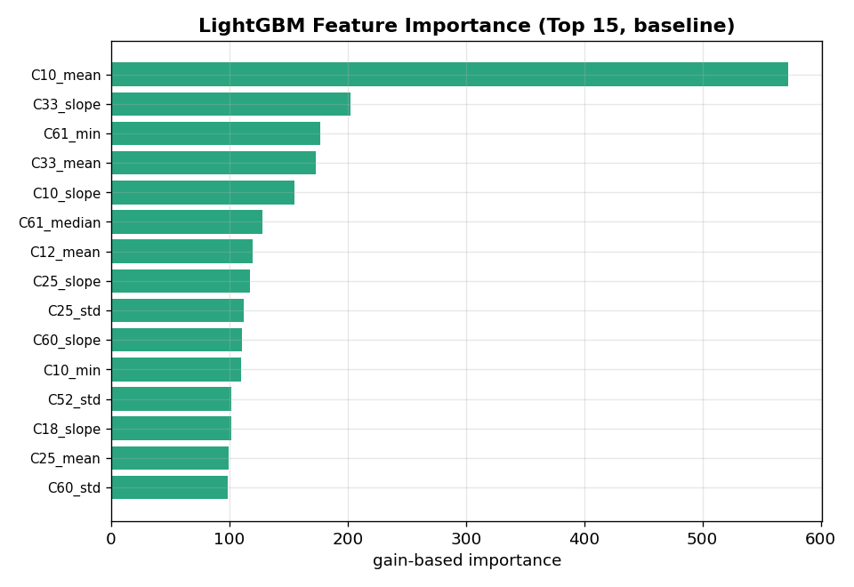

# modeling_v3 결과 보고서

> **실험명**: Optuna 하이퍼파라미터 자동 탐색
> **한 줄 결과**: **Test RMSE 60.51 — 전 버전 통틀어 최선.** 단, baseline 대비 개선폭은 0.6pt뿐
> **교훈**: 하이퍼파라미터 튜닝의 여지는 이미 거의 소진됨 → 병목은 파라미터가 아니라 피처(데이터 표현)
> 실험일: 2026-07-03

## 1. 실험 목적

baseline의 수동 파라미터(RMSE ~62.5)를 Optuna TPE 탐색으로 최적화하여 RMSE를 목표 ~40에 근접시키는 것.

### 사용한 피처
- **baseline과 동일한 피처(글로벌 WF 집계 299개)** 를 그대로 사용했습니다. 피처는 건드리지 않고 **오직 하이퍼파라미터만** 바꿔, 튜닝만의 순수 효과를 측정하는 설계입니다.
- 즉 원본 컬럼 사용 범위는 baseline과 같습니다(FDC 센서 37개 집계 + C6/C7 + C33 + 시간/n_rows).

---

## 2. 실험 설정

| 항목 | 설정 |
|------|------|
| 피처 | v1 동일 (글로벌 집계, 299개) |
| 탐색 알고리즘 | TPESampler (seed=42) |
| Trial 수 | 100 |
| CV | GroupKFold 5-Fold (C64 기준) |
| Early stopping | 50 rounds (탐색 시) / 100 rounds (최종 학습) |
| n_estimators 상한 | 3,000 |

---

## 3. 성능 결과

### 3.1 RMSE 비교

*v3(가운데)가 Valid·Test 모두 가장 낮음. 하지만 목표선(빨간 점선, 40)까지는 여전히 큰 격차.*

| 모델 | CV OOF | Valid | Test | 피처 수 |
|------|--------|-------|------|---------|
| 베이스라인 (평균) | — | 258.97 | — | — |
| **v1** (수동 파라미터) | 62.88 | 62.53 | 61.15 | 315 |
| **v2** (Step별 피처) | 63.12 | 62.72 | 61.25 | 816 |
| **v3** (Optuna 튜닝) | **62.19** | **62.31** | **60.51** | 299 |
| 목표 | — | ~40 | ~40 | — |

### 3.2 v1 대비 변화

- CV RMSE: 62.88 → 62.19 (**-0.69**)
- Valid RMSE: 62.53 → 62.31 (**-0.22, +0.35% 개선**)
- Test RMSE: 61.15 → 60.51 (**-0.64, +1.05% 개선**)
- CV↔Valid 격차: 0.12 (매우 안정적)

### 3.3 Fold별 성능

| Fold | RMSE | best_iteration |
|------|------|----------------|
| 1 | 62.13 | 932 |
| 2 | 62.13 | 1,083 |
| 3 | 61.57 | 1,102 |
| 4 | 62.52 | 845 |
| 5 | 62.61 | 1,156 |
| **평균 ± 표준편차** | **62.19 ± 0.37** | |

### 3.4 Optuna 최적 파라미터

| 파라미터 | v1 (수동) | v3 (Optuna) | 변화 |
|----------|----------|-------------|------|
| learning_rate | 0.05 | 0.00576 | 8.7× 낮아짐 |
| num_leaves | 63 | 189 | 3× 복잡해짐 |
| max_depth | -1 (무제한) | 10 | 제한 추가 |
| min_child_samples | 20 | 14 | 소폭 완화 |
| subsample | 0.8 | 0.967 | 거의 전체 사용 |
| colsample_bytree | 0.8 | 0.655 | 피처 다양성 증가 |
| reg_alpha | 0.1 | 4.256 | L1 정규화 강화 |
| reg_lambda | 1.0 | 0.003 | L2 정규화 약화 |
| min_split_gain | 0 | 0.758 | 분할 기준 엄격 |
| best_iteration | ~100 | ~1,000 | 10× 더 많은 트리 |

> **읽는 법**: learning_rate가 8.7배 낮아지고 트리 수가 10배 늘었다는 건, 모델이 **더 천천히·더 여러 번 나눠서** 학습하도록 바뀐 것입니다. 그런데도 개선이 0.6pt뿐이라는 건, 모델이 아무리 세밀하게 파고들어도 **데이터에서 뽑아낼 신호가 이미 거의 다 소진**됐다는 뜻입니다.

### 3.5 피처 중요도 (모델이 실제로 쓰는 변수)

*학습된 트리가 각 피처를 얼마나 활용했는지(gain 기준 상위 15). C10(시간)·C33(PM)·C61·C12가 상위.*

- EDA의 상관계수에서는 C17이 1위였지만, 트리 **중요도**에서는 C10_mean·C33_slope 등이 앞섭니다.
- 이는 오류가 아니라 지표의 차이입니다: 상관은 "직선 관계", 중요도는 "트리가 값을 쪼개 쓰기 좋은 정도"를 봅니다. 시간·PM처럼 값이 다양한 변수는 쪼갤 지점이 많아 중요도가 높게 잡힙니다.
- **시사점**: 직접 상관이 0이던 PM(C33)도 트리에선 비선형 신호로 실제 기여 → 피처 유지가 정당. 반대로, 이미 상위 피처가 대부분의 설명력을 가져가 **새 피처를 넣어도 추가 신호가 적다**는 점이 v2·v4 실패와 연결됩니다.
---

## 4. 결과 분석

### 4.1 개선이 제한적인 이유

Optuna로 100 trials 탐색했지만 RMSE 개선은 ~0.5pt에 그쳤습니다. 이는 **현재 피처 세트(글로벌 WF 집계)로 추출 가능한 정보의 한계**에 가까이 도달했음을 시사합니다.

핵심 관찰:
- learning_rate가 0.05→0.006으로 크게 낮아지고, 트리 수가 100→1,000으로 10배 증가
- 이는 모델이 더 세밀하게 학습하려 하지만, 피처 자체의 정보량이 부족하여 큰 개선이 불가능
- **병목은 하이퍼파라미터가 아니라 피처(데이터 표현)에 있음**

### 4.2 RMSE 62→40 달성을 위한 시사점

현재 접근법(WF 단위 통계 집계 → LightGBM)으로는 RMSE ~60이 한계선으로 보입니다. 62→40은 ~35% 추가 개선이 필요한데, 이 수준의 개선은 근본적으로 다른 접근이 필요합니다.

---

## 5. 다음 단계 제안

| 우선순위 | 방법 | 기대 효과 | 근거 |
|---------|------|----------|------|
| 1 | **멀티모델 앙상블** | 2~5pt 개선 | LightGBM + XGBoost + CatBoost 가중 평균. 서로 다른 모델의 약점 보완 |
| 2 | **피처 엔지니어링 재설계** | 5~15pt 개선 가능 | 현재 접근의 한계가 피처에 있으므로, 근본적으로 다른 피처 추출 방식 시도 (예: row-level 예측 후 WF 집계, 센서 간 비율/차이 피처, 이동평균) |
| 3 | **Target Encoding** | 2~5pt 개선 | C6, C7에 대한 타깃 인코딩으로 범주형 변수의 비선형 효과 포착 |
| 4 | **딥러닝 (1D-CNN / LSTM)** | 미지수 | 시계열 패턴을 직접 학습. 구현 비용 높지만 돌파구 가능 |

---

## 6. 파일 목록

| 파일 | 내용 |
|------|------|
| `modeling_v3.ipynb` | v3 모델링 노트북 |
| `modeling_v3_README.md` | 노트북 안내서 |
| `modeling_v3_REPORT.md` | 본 보고서 |
| `optuna_best_params_v3.json` | 최적 파라미터 + RMSE 기록 |
| `valid_Y_submit.csv` | Valid 예측 결과 |
| `test_Y_submit.csv` | Test 예측 결과 |
