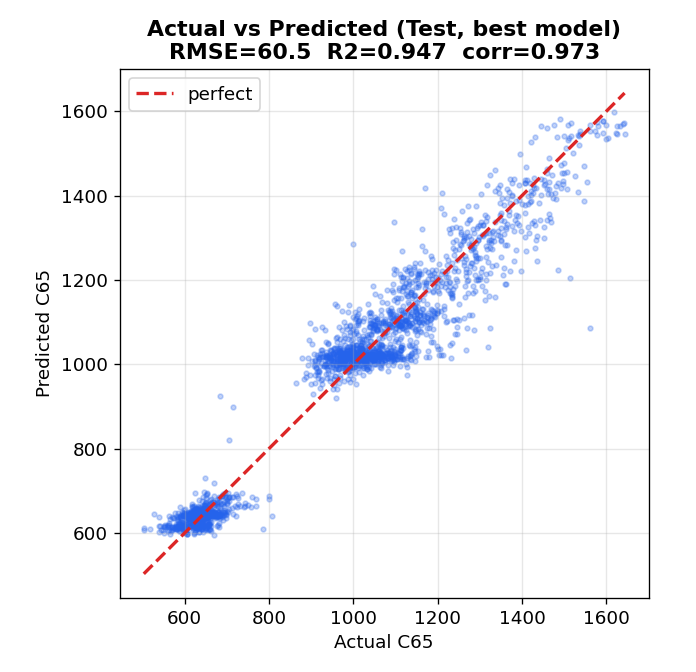
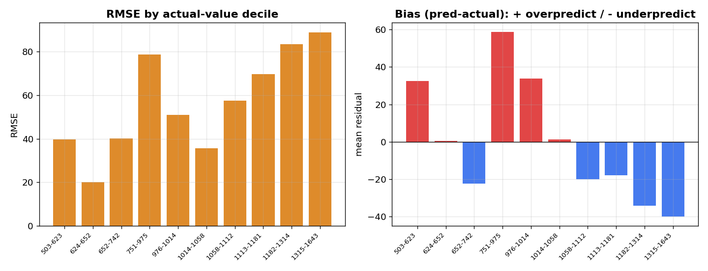

# modeling_v5 결과 보고서

> **실험명**: Row-level 예측(step 단위 → 웨이퍼 평균) + 데이터 재탐색(C23 재발굴)
> **한 줄 결과**: **Valid RMSE 61.38로 역대 최선**, 그러나 Test 60.52로 v3와 동일 — 천장 미돌파
> **교훈**: 접근법을 바꿔도 tabular 프레임의 ~60 천장은 그대로. 유효 신호는 조금 더 뽑았으나 돌파구는 아님
> 실험일: 2026-07-03 (세션 3)

---

## 1. 실험 목적

세션2에서 "WF 단위 통계 집계 → tabular ML" 프레임의 RMSE 천장이 ~62로 확인됨. 두 가지 가설을 검증:

1. **데이터 재탐색**으로 이전 버전이 놓친 컬럼(특히 C23)을 되살리면 신호가 추가되는가?
2. **Row-level 예측**(step 단위 → WF 평균)으로 WF 평균에 뭉개지던 step×센서 상호작용을 살리면 천장을 넘는가?

---

## 2. 데이터 재탐색 결과 (세션3)

| 발견 | 근거 (train 전체) | 조치 |
|------|------|------|
| **C23이 잘못 버려졌다** | C6은 99.2%가 한 값(거의 상수), 반면 C23은 28종 실제 변동. C23 타깃인코딩 단독 OOF 상관 0.21, RMSE 261.7→255.7. valid/test 미관측 카테고리 0개(일반화 안전) | **추가** (out-of-fold TE) |
| **step×센서 상호작용 강함** | 핵심 센서 C17 상관이 step별로 C7=5:0.80, C7=4:0.72, C7=1:0.19. WF 평균 시 -0.31로 희석 | row-level + C7 범주형 |
| **C36 = C7** | 완전 1:1 일치 | drop |
| **C30 상수** | 1종 | drop |
| **C40 / C41 무신호** | C40 step 간격 3.0초±0.3 일정, C41 row-level 상관 ≈ 0.0007 | drop |

결론: 이전 세션 컬럼 처리 중 **유일한 실질 누락은 C23**이었고, row-level 방향은 데이터로 정당화됨.

---

## 3. 성능 결과

### 3.1 RMSE 비교

*v5(오른쪽에서 두 번째)는 Valid(파랑)가 가장 낮지만 Test(주황)는 v3와 동일.*

| 모델 | CV OOF | Valid | Test | 예측 단위 |
|------|--------|-------|------|-----------|
| 베이스라인 (평균) | — | 258.97 | — | — |
| v1 (baseline) | 62.88 | 62.53 | 61.15 | WF |
| v2 (Step별 집계) | 63.12 | 62.72 | 61.25 | WF |
| **v3 (Optuna)** | **62.19** | 62.31 | **60.51** | WF |
| v4 (피처 재설계) | 63.09 | 63.42 | 61.19 | WF |
| **v5 (Row-level + C23)** | 62.63 | **61.38** | 60.52 | **row → WF 평균** |
| 목표 | — | ~40 | ~40 | — |

### 3.2 v3(최선) 대비 변화

- CV OOF: 62.19 → 62.63 (**+0.44, 소폭 악화**)
- Valid: 62.31 → 61.38 (**-0.93, 역대 최선 Valid**)
- Test: 60.51 → 60.52 (**+0.01, 사실상 동일**)

---

## 4. 결과 분석

### 4.1 판정: 부분 성공, 천장은 미돌파

Row-level 전환 + C23 추가로 **Valid는 역대 최선(61.38)**을 기록했지만, **Test는 60.5로 완전히 정체**됨. 즉 접근은 유효 신호를 조금 더 뽑아냈으나, ~60 천장을 깨는 돌파구는 아니었음.

### 4.2 왜 천장을 못 넘었나

- row에 **WF 전역 context(집계)를 함께 broadcast**했기 때문에, 트리는 여전히 가장 강한 단일 신호인 WF 평균 센서(C17_wf_mean 등, 상관 -0.797)에 크게 의존. row 단위의 step별 미세 신호는 이 강한 전역 신호 대비 한계 기여.
- C23은 독립 신호이나 eta² ~4.8%로 기여폭 자체가 작음(단독 RMSE 개선 ~6pt, 다른 피처와 상당 부분 중복).
- **62→40은 ~35% 개선**이 필요한데, tabular(트리) 계열에서 얻을 수 있는 표현력은 v1~v5로 소진된 것으로 보임.

> 셀 7의 피처 중요도(gain)에서 `*_wf_*` 집계 피처가 상위를 점하고 `row_pos`/`C23_te`가 하위라면 위 해석이 확정됨. (실행 로그에서 확인 권장)

### 4.3 하이퍼파라미터 미튜닝 여지

v5는 수동 파라미터(lr=0.03, num_leaves=127)로만 학습. Optuna 재튜닝 시 ~0.5pt 추가 가능하나, v3 경험상 천장 돌파에는 무의미.

---

## 4.5 모델 검증 그래프 (v5 실제 제출 결과 기준)

아래 두 그래프는 v5가 실제로 제출한 Test 예측(`outputs/test_Y_submit.csv`)을 정답과 비교해 그린 것입니다.

### 실제값 vs 예측값

- **R² 0.947, 상관 0.973**으로 예측이 매우 정확합니다(점이 대각선에 밀집).
- 다만 양 끝이 대각선 안쪽으로 휨 → **극단값을 평균 쪽으로 당기는(shrinkage)** 경향이 보입니다.

### 오차가 어디서 나는가 (10분위 편향)

*왼쪽: 정답 크기순 10구간별 RMSE. 오른쪽: 편향(빨강=과대예측, 파랑=과소예측).*

| 정답 구간 | RMSE | 편향 | 진단 |
|-----------|------|------|------|
| 503~623 | 39.7 | +32.4 | 낮은 값 과대예측(수축) |
| **742~976** | **78.8** | **+58.8** | **비정상 과대예측 — 놓친 신호** |
| 1315~1643 | 89.0 | -39.9 | 높은 값 과소예측(수축) |

- 양극단 수축은 트리 회귀의 구조적 한계입니다.
- 그런데 **742~976 구간의 +58.8 편향**은 단순 수축으로 설명되지 않는 이상 신호입니다. 이 구간 웨이퍼들이 공유하는 특성(특정 레시피 C23_14/C23_12, 센서 임계 등)을 모델이 놓치고 있다는 뜻 → **다음 실험(regime 진단)의 핵심 단서**가 됩니다.

---

## 5. 다음 단계 제안

tabular 프레임(집계·row-level 모두)이 ~60에서 수렴함이 v1~v5로 확정됨. 목표 ~40은 **시계열 구조를 직접 학습하는 모델**로만 가능성이 있음.

| 우선순위 | 방법 | 기대 | 근거 |
|---------|------|------|------|
| **1** | **시퀀스 모델 (1D-CNN / LSTM / GRU)** | 미지수, 유일한 돌파 후보 | WF당 step 시퀀스를 순서대로 입력. step×센서 상호작용을 집계 없이 직접 학습. row-level에서 신호 존재는 확인됨 |
| 2 | **멀티모델 앙상블 (LGB+XGB+CatBoost)** | 1~3pt | 천장 근처 미세 개선. 리더보드 방어용 |
| 3 | **v5 Optuna 재튜닝** | ~0.5pt | 비용 대비 효과 낮음 |

### 권장 실행안 (v6)

시퀀스 모델을 우선 시도하되, 실측 근거를 먼저 확보:
- WF당 step 순서(C7 또는 C40 정렬)를 고정 길이(예: 최대 24 step, padding/masking)로 정렬한 3D 텐서 구성
- 입력 채널 = 38개 센서, 시퀀스 축 = step
- 1D-CNN(빠름) → 성능 확인 후 LSTM/GRU로 확장
- GroupKFold(C64) 유지, WF 단위 RMSE로 평가
- PyTorch 필요 (requirements.txt 추가)

---

## 6. 파일 목록

| 파일 | 내용 |
|------|------|
| `modeling_v5.ipynb` | v5 Row-level 모델링 노트북 |
| `modeling_v5_README.md` | 노트북 안내서 |
| `modeling_v5_REPORT.md` | 본 보고서 |
| `outputs/valid_Y_submit.csv` | Valid 예측 결과 |
| `outputs/test_Y_submit.csv` | Test 예측 결과 |
| `outputs/results.json` | OOF 62.63 / Valid 61.38 / Test 60.52 |
