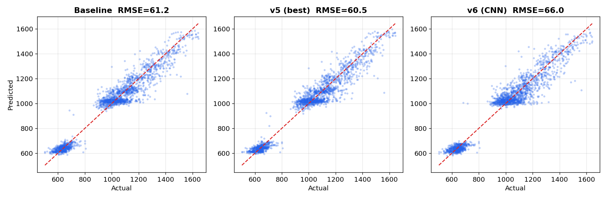

# modeling_v6 결과 보고서

> **실험명**: 시퀀스 딥러닝(1D-CNN) — 공정 단계 순서를 직접 학습
> **한 줄 결과**: **Test RMSE 66.04 — tabular 대비 +5.5pt 크게 악화. 딥러닝 방향 종료**
> **교훈**: 표본 1.2만·시퀀스 길이 ~10은 딥러닝에 부족. 소표본 표 데이터는 GBDT가 우위
> 실험일: 2026-07-03 (세션 3)

---

## 1. 실험 목적

tabular 프레임(v1~v5)이 RMSE ~60에서 수렴. step **순서 구조**를 직접 학습하는 딥러닝으로 천장 돌파를 시도.

### 사용한 입력 (원본 컬럼 기준)
- 웨이퍼당 (최대 16단계 × 41채널) 3차원 텐서: **원본 FDC 센서 36개(표준화)** + **C7(공정단계) one-hot 5개**.
- **C23(레시피 28종)** 은 임베딩(숫자 벡터)으로 변환해 결합.
- 즉 트리 모델과 같은 원본 컬럼을 쓰되, **요약하지 않고 순서를 보존한 형태**로 넣은 것이 차이입니다.

---

## 2. 실험 설정

| 항목 | 설정 |
|------|------|
| 입력 텐서 | WF당 (MAX_LEN=16, 41채널) — 36 센서 표준화 + C7 one-hot 5 |
| 정렬 | C40 시간순 (원본순서와 99% 일치), 초과 step truncate, zero-padding + mask |
| C23 | 임베딩(dim 8)으로 pooled feature에 concat |
| 모델 | Conv1d×3 + BatchNorm + masked mean pooling + FC |
| 타깃 | 표준화 후 학습, 예측 시 역변환 |
| CV | GroupKFold 5-Fold (C64), WF-level RMSE |
| 학습 | Adam lr=1e-3, ReduceLROnPlateau, early stopping(patience=8), 최대 60ep |

---

## 3. 성능 결과

| 모델 | CV OOF | Valid | Test |
|------|--------|-------|------|
| v3 (Optuna) | 62.19 | 62.31 | **60.51** |
| v5 (Row-level + C23) | 62.63 | **61.38** | 60.52 |
| **v6 (1D-CNN)** | 68.92 | 68.26 | 66.04 |
| 목표 | — | ~40 | ~40 |

**판정: 실패.** 1D-CNN은 tabular 대비 Test +5.5pt 악화.

*맨 오른쪽 v6가 유일하게 크게 솟아 있음 — 딥러닝이 오히려 나쁨을 한눈에 확인.*

### 모델별 예측 비교 (Baseline / v5 / v6)

*세 모델의 Test 예측 vs 정답. baseline·v5는 대각선에 밀집(정확)하지만, v6(오른쪽)는 점이 더 넓게 흩어져 있습니다 — 딥러닝이 관계를 안정적으로 잡지 못했음을 시각적으로 보여줍니다.*

### 왜 딥러닝이 졌나

- **표본 부족**: WF 11,939개는 딥러닝에 작음. GBDT가 소표본·저잡음 tabular에서 우위.
- **시퀀스가 짧고 약함**: step 9~16개, C40 간격도 균일(3초) → 순서 정보가 얇음.
- 가장 강한 신호(WF 평균 C17, r=-0.797)는 트리가 쉽게 잡지만, CNN은 12k 표본에서 처음부터 학습하며 이를 안정적으로 재현하지 못함.

> Cell 8 LSTM 변형도 동일 표본·시퀀스 한계를 공유하므로 큰 개선 기대난망. **딥러닝 방향은 종료 권장.**

---

## 4. 오차 분석 (최선 모델 v5, Test 기준)

시퀀스가 실패했으므로, 남은 RMSE ~60이 **어디서** 오는지 진단.

### 4.1 전체

- RMSE 60.52, MAE 44.8, **R² 0.947**, corr(pred,ans) **0.973** → 이미 매우 강함.
- 예측 std 253 vs 정답 std 262 → 약한 수축(shrinkage).

### 4.2 정답 10분위별 RMSE·편향 (핵심)

*왼쪽: 구간별 RMSE. 오른쪽: 편향(빨강=과대예측, 파랑=과소예측). 4번째 막대(742~976)의 +58.8 스파이크가 핵심 단서.*

| 정답 구간 | RMSE | 편향(pred-ans) |
|-----------|------|----------------|
| 503~624 (최저) | 39.7 | **+32.4** (과대예측) |
| 624~652 | 20.1 | +0.5 |
| 652~742 | 40.1 | -22.3 |
| **742~976** | **78.8** | **+58.8** (심한 과대예측) |
| 976~1014 | 51.0 | +33.7 |
| 1014~1058 | 35.6 | +1.3 |
| 1058~1112 | 57.5 | -20.0 |
| 1112~1181 | 69.7 | -17.9 |
| 1181~1314 | 83.5 | -34.1 |
| 1314~1643 (최고) | 89.0 | **-39.9** (과소예측) |

**패턴**: (1) 양극단에서 평균으로 수축 — 낮은 값 과대·높은 값 과소예측, (2) **742~976 구간의 +58.8 스파이크**는 단순 수축이 아닌 **특정 regime을 놓친 신호**.

### 4.3 recipe별 오차

C23_14(MAE 55), C23_12(50.7)가 최상위 → 특정 레시피에서 오차 집중. regime 피처 부재 가능성.

---

## 5. 다음 단계 제안 (방향 재조정)

딥러닝 종료. 남은 현실적 카드는 **오차 구조를 직접 겨냥**하는 것.

| 우선순위 | 방법 | 기대 | 근거 |
|---------|------|------|------|
| **1** | **regime 진단 → 세그먼트 피처/모델** | 미지수(최대 잠재력) | 742~976 구간 +59 편향은 놓친 그룹 신호. 이 WF들의 공통점(C23/C7 조합/센서 임계)을 찾아 피처화 또는 구간별 모델 |
| **2** | **멀티모델 앙상블** | 1~3pt | v3 LGB + v5 row-level + XGB + CatBoost. 서로 다른 편향 상쇄. ~59 안정 확보 |
| 3 | **OOF 기반 사후 보정(calibration)** | 0~2pt | 극단 수축을 isotonic/선형 보정. 단 tail 과적합 주의, OOF로만 |
| ~~4~~ | ~~딥러닝(LSTM 등)~~ | 표본 한계로 종료 | v6에서 확인 |

### 현실성 메모

R² 0.947 → 목표 RMSE 40은 R² 0.977 필요. 현재 피처로 남은 ~5% 분산의 절반 이상을 더 잡아야 함. "난이도 下·목표 40"이 맞다면 **742~976 regime의 놓친 신호**가 열쇠일 가능성이 높음. 1순위(regime 진단)를 먼저 파는 것을 권장.

---

## 6. 파일 목록

| 파일 | 내용 |
|------|------|
| `modeling_v6.ipynb` | 1D-CNN 시퀀스 모델 (+ Cell 8 LSTM 변형) |
| `modeling_v6_README.md` | 노트북 안내서 |
| `modeling_v6_REPORT.md` | 본 보고서 |
| `outputs/results.json` | OOF 68.92 / Valid 68.26 / Test 66.04 |
