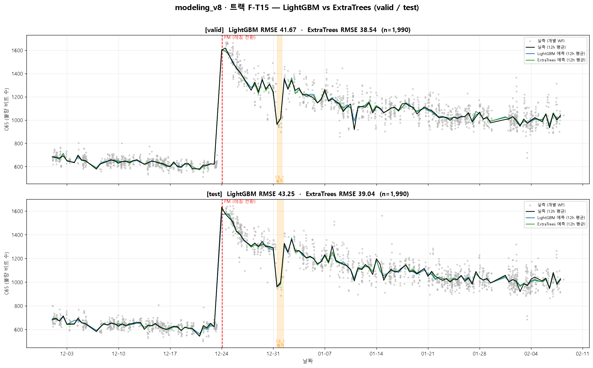

# M2 추가 후보 2종 상세 정리 — F-T15 · F-P3

> 출처: `modeling_v8/REPORT/modeling_v8_REPORT_03_M2.md` (스냅샷, 2026-07-09)
> 컬럼 의미: `데이터 사전 v3 — train_data.csv 컬럼 최종 유추본`
> 성격: M2에서 **채택은 기각**되었으나, PLAN v1.6 §8.5에서 **관찰 트랙(동결)** 으로 승격되어
> M5a~M8 전 구간에서 챔피언 **F-C10**(코어 10)과 병행 추적되는 두 후보의 도출·구성·판정 기록.

---

## 0. 배경 — M2는 무엇을 물었나

M0b에서 확정된 **코어 10**(시간/레짐 + 검증된 센서 3종)이 이미 CV 40.35를 냈다.
M-T 대조군은 "센서 블록(C59·C60 step4 집계 + 레시피)이 시간축 위에서 **+3.91pt** 기여한다"를 증명했다.

**M2의 질문**: 코어 10에 쓴 센서 3종 말고, **나머지 FDC 집계 풀 전체(23센서 × 5통계 × step ≈ 550개)** 에 추가로 건질 신호가 있는가? 특히 EDA에서 급등 레짐 내부 상관 +0.459였던 **C25**가 gain 랭킹에 올라오는가?

결론부터: **어떤 조합도 코어 10을 못 넘어 전부 기각.** 그중 성능이 가장 근접했던 두 후보가 F-T15와 F-P3이며, 관찰용으로 동결됐다.

---

## 1. 공통 도출 파이프라인 — 2-pass gain 재선별

두 후보 모두 **하나의 실험(M2)** 에서 나온 산출물이다. 절차:

| 단계 | 내용 |
|---|---|
| **POOL 구성** | 코어 10의 비센서 8개(시간/레짐 7 + `is_special_recipe`) + **전체 센서 집계 풀** = **563 피처**. (id·타깃·문자열 `C23`/`C6`·pkl 별칭 제외) |
| **pass 1 (gain 랭킹)** | 563 피처 통째로 wafer 5-fold OOF 학습 → fold-평균 **gain** 랭킹 산출. (풀 통째 CV = **53.01** — 고차원 노이즈에 신호가 묻힘) |
| **pass 2-A (TOP_N 스윕)** | gain 상위 TOP_N ∈ {10,12,15,20,25} 재선별 후 각각 CV → **F-T15**(TOP_15)가 이 경로의 최고 |
| **pass 2-B (probe)** | 검증된 코어 10을 **유지**하고 gain 상위 신규 센서 K ∈ {3,5,8}개만 **추가** → **F-P3**(코어10+3)가 이 경로의 최소 악화 |

- 파라미터·CV 스킴은 M0~M1과 동일: 복원 pkl PARAMS(M8_PARAMS), wafer `KFold(shuffle, 42)`, full-train 705 라운드.
- **채택 게이트**: ΔCV ≤ −0.3 (코어 10 대비 최소 0.3pt 개선). 두 후보 모두 오히려 악화 → **기각**.

즉 **F-T15 = "gain이 알아서 고른 상위 15개"**(자동 선택), **F-P3 = "검증된 코어 10을 지키고 gain 상위 신규 센서 3개만 얹은 것"**(보수적 증분). 접근 철학이 정반대인 두 후보다.

---

## 2. F-T15 — gain TOP_15 (자동 선택 경로)

### 2.1 도출 방법
pass 1의 563피처 fold-평균 gain 랭킹에서 **상위 15개를 그대로** 잘라 재선별 → 다시 CV. TOP_N 스윕(10/12/15/20/25) 중 **TOP_15가 최저 CV**였다.

### 2.2 성능
| 지표 | 값 |
|---|---|
| CV(wafer) | **43.937** |
| valid | 41.674 |
| test | 43.253 |
| ΔvsM0b(40.347) | **+3.590 → ❌ 기각** |

### 2.3 최종 사용 피처 (15개) — 컬럼 의미

| 순위 | 피처 | 상대 gain | 원본 컬럼 의미 (데이터 사전 v3) |
|:---:|---|:---:|---|
| 1 | `is_high_regime` | 50.2% | **[파생]** 급등/저불량 **레짐 스위치**(verdict 상태기계). loud PM에서만 상태 갱신 |
| 2 | `high_regime_days` | 27.2% | **[파생]** 마지막 **loud PM 이후** 급등 레짐 경과일 |
| 3 | `days_since_last_pm` | 9.1% | **[파생]** 마지막 PM(모든 리셋) 이후 경과일(float 일수, `_REF_DATE=2018-12-01`) |
| 4 | `C12_mean_step6` | 4.4% | **C12** = Step 단위로 갱신되는 **Vdc 연동 기준값**(Vdc 목표/한계, 구조 확정·물리명 미상) — step6 평균 |
| 5 | `C33` | 1.7% | **C33** = **PM 경과 카운터**(1~74, 리셋=PM 이벤트) — WF 첫 행 |
| 6 | `dslp_x_hour` | 0.5% | **[파생·교호]** `days_since_last_pm × hour` |
| 7 | `C12_mean_step7` | 0.5% | **C12**(Vdc 연동 기준값) — step7 평균 |
| 8 | `hour` | 0.4% | **[파생]** WF 첫 행 취득 시각의 시(0~23, C40 기준) — 일주기 |
| 9 | `C4_mean_step4` | 0.3% | **C4** = **가스 유량 Setpoint A**(설정값, step4 recipe별 40/60) — step4 평균 |
| 10 | `C4_max_step1` | 0.3% | **C4**(가스 Setpoint A, step1 램프업 구간) — step1 최대 |
| 11 | `hour_x_c33` | 0.2% | **[파생·교호]** `hour × C33` |
| 12 | `C12_max_step6` | 0.2% | **C12**(Vdc 연동 기준값) — step6 최대 |
| 13 | `C61_mean_step1` | 0.1% | **C61** = RF 파형 **음(−)측 피크 전압** 후보(Vmin 계열) — step1 평균 |
| 14 | `C60_std_step4` | 0.1% | **C60** = C59/C60 **멀티플렉스 2채널** 판독값(완전 상호배타) — step4 표준편차 |
| 15 | `C62_mean_step1` | 0.1% | **C62** = **RF 전극 전압**(Vpp 계열, 점화 반전) — step1 평균 |

### 2.4 왜 기각됐나 — 핵심 결함
- **검증된 코어 센서가 통째로 빠졌다.** 코어 10의 `C59_mean_step4`·`C60_mean_step4`·`is_special_recipe`가 F-T15에 **없다**. C59/C60은 개별 gain이 ~18위로 미미해 gain-greedy가 떨궈버렸지만, M-T·M4 ablation에서 **집단으로 빼면 +3.91pt 악화**하는 "집단 필수" 피처다(FEATURE_SPEC §5 경고 그대로 재현).
- **대신 주운 신규 센서가 일반화가 나쁘다.** gain 4위로 튄 `C12_mean_step6`는 EDA상 전체 상관 0.338이나 **레짐 내부 −0.02/−0.10으로 죽는 레짐 프록시**(C17과 동형). 그 gain은 레짐 신호에서 빌려온 허상이라, 실제 투입 시 중복·노이즈만 얹힌다.
- 순수 gain 랭킹만 믿으면 **"저-gain·고-집단가치" 피처를 버리고 "고-gain·저-일반화" 피처를 줍는** 전형적 실패. C25도 최고 23위로 부상 실패.

---

## 3. F-P3 — 코어10 + 신규센서 3 (보수적 증분 경로)

### 3.1 도출 방법
pass 2-B probe: **검증된 코어 10을 그대로 고정**하고, gain 상위 신규 센서(코어 10 밖)를 **누적으로** 추가(+3/+5/+8). 그중 **+3이 최소 악화**였다. 추가된 3개는 신규 gain 랭킹 1·2·3위(`C12_mean_step6`, `C12_mean_step7`, `C4_mean_step4`).

### 3.2 성능
| 지표 | 값 |
|---|---|
| CV(wafer) | **41.052** |
| valid / test | 미조회 (M5a에서 최초 기록 예정 — §8.5 마일스톤 1회 규율) |
| ΔvsM0b(40.347) | **+0.705 → ❌ 기각** (전 조합 중 최소 악화) |
| 피처 수 | **13개** (코어 10 + 3) |

참고 누적: 코어10+3 = 41.05(Δ+0.71) < +5 = 41.29 < +8 = 43.03 < +C25 = 43.66. 추가할수록 악화.

### 3.3 최종 사용 피처 (13개) — 컬럼 의미

**A. 코어 10 (검증된 챔피언 F-C10 그대로 계승)**

| 블록 | 피처 | 원본 컬럼 의미 |
|---|---|---|
| 시간/레짐 7 | `is_high_regime` | **[파생]** 레짐 스위치(verdict 상태기계) |
| | `high_regime_days` | **[파생]** 마지막 loud PM 이후 급등 레짐 경과일 |
| | `days_since_last_pm` | **[파생]** 마지막 PM 이후 경과일(float) |
| | `hour` | **[파생]** WF 첫 행 시각의 시(0~23) |
| | `C33` | **PM 경과 카운터**(1~74, 리셋=PM) |
| | `dslp_x_hour` | **[파생·교호]** dslp × hour |
| | `hour_x_c33` | **[파생·교호]** hour × C33 |
| 센서/레시피 3 | `C59_mean_step4` | **C59** = 멀티플렉스 2채널 판독(상호배타) — step4 평균 |
| | `C60_mean_step4` | **C60** = C59의 짝 채널 판독 — step4 평균 |
| | `is_special_recipe` | **[파생]** 레시피 특수(C6_1) 여부 — C6 기반 |

**B. 신규 추가 센서 3 (gain 상위)**

| 신규순위 | 피처 | gain% | 원본 컬럼 의미 |
|:---:|---|:---:|---|
| 1 | `C12_mean_step6` | 4.38% | **C12** = Vdc 연동 기준값 — step6 평균 |
| 2 | `C12_mean_step7` | 0.46% | **C12** = Vdc 연동 기준값 — step7 평균 |
| 3 | `C4_mean_step4` | 0.33% | **C4** = 가스 유량 Setpoint A — step4 평균 |

### 3.4 왜 기각됐나
- **검증된 코어를 지켰기에 F-T15보다는 훨씬 근접**(+0.71 vs +3.59)했지만, 여전히 코어 10을 **넘지 못했다**. 추가한 3종이 순이득이 아니라 **순손실**.
- 신규 3종 중 편중이 뚜렷: **C12가 2개**(step6·step7 평균). 그러나 C12는 3.2.4에서 본 대로 **레짐 프록시**라 레짐 피처(`is_high_regime`+시간)가 이미 그 변동을 흡수한 뒤엔 중복·노이즈만 남는다. `C4`도 설정값(상수성 강함)이라 WF 변별력이 낮다.
- 결론: "gain 높아 보이는 신규 센서"조차 **검증된 코어에 얹으면 실익이 없음**을 확증.

---

## 4. 두 후보 비교

| 축 | **F-T15** | **F-P3** |
|---|---|---|
| 도출 경로 | gain TOP_N 스윕 (자동 선택) | 코어10 고정 + gain 상위 K 추가 (보수적 증분) |
| 피처 수 | 15 | 13 |
| 코어 센서(C59/C60_mean_step4) | **없음** ✗ | **있음** ✓ |
| is_special_recipe | 없음 ✗ | 있음 ✓ |
| C12 계열 | 3종(mean s6/s7, max s6) | 2종(mean s6/s7) |
| CV | 43.937 | 41.052 |
| valid / test | 41.674 / 43.253 | 미조회 (M5a 최초) |
| ΔvsM0b | +3.590 | +0.705 |
| 판정 | ❌ 기각 | ❌ 기각(최소 악화) |
| 관찰 트랙 가치 | 코어 센서 없이 C12 프록시로 레짐을 감지 — **H-T1 가설**(COLD·pm_log 공백 시 백업 피처셋) 검정 대상 | 코어에 근접한 대안 — 챔피언과의 미세 격차 추적 |

두 후보 모두 M2에서 **성능상 기각**됐지만, PLAN v1.6 §8.5에서 **동결 관찰 트랙**으로 승격됐다. 규칙: 보고 전용(선정·튜닝·제출 미개입), M5b 재튜닝 금지(전이 평가 1회), 승격은 3조건(CV≤−0.3 ∧ M7 우위 ∧ std 감안) 예외 절차. 특히 **H-T1 가설** — M8-S2(COLD, 레짐 피처가 상수화되는 시나리오)에서 C12 프록시 센서가 새 레짐을 부분 감지해 raw bias가 챔피언보다 완만한지 검정 — 확인 시 "pm_log 공백 상황 백업 피처셋"의 실무 가치가 생긴다.

---

## 5. 한 줄 결론

**F-T15**(gain 자동선택 15개)와 **F-P3**(코어10+신규센서3, 13개)는 M2의 2-pass gain 재선별에서 나온 두 근접 후보다. 전자는 gain만 믿다 **집단 필수 센서(C59/C60)를 떨궈** +3.59pt 악화, 후자는 코어를 지켰으나 **레짐 프록시(C12) 중복**으로 +0.71pt 악화 — 둘 다 채택 게이트를 못 넘어 **코어 10 챔피언(F-C10) 유지**로 귀결. 다만 두 후보는 M5a~M8에서 병행 추적되는 **동결 관찰 트랙**으로 살아있다.
