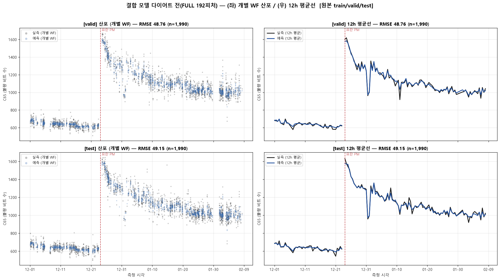
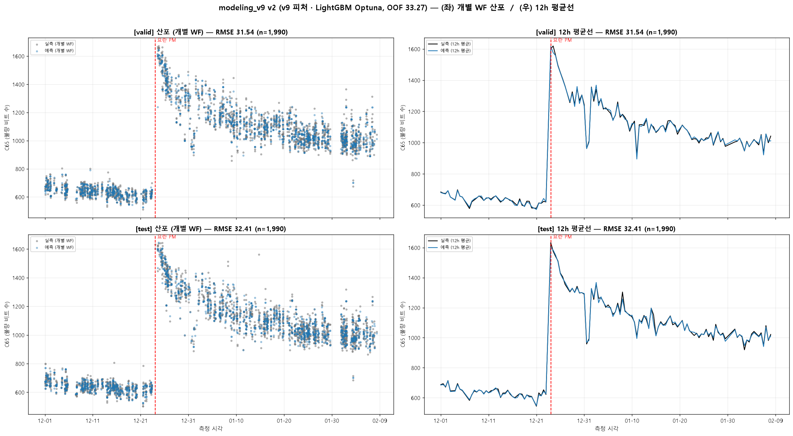
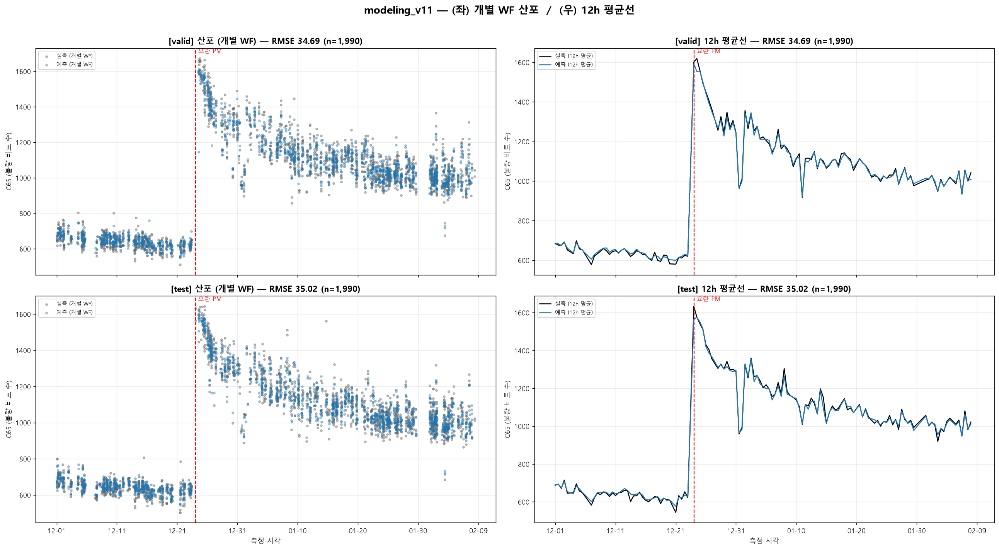

# 산포도 비교 최종 보고서 — 6개 모델

> **과제**: FDC 센서 Trace → 웨이퍼별 결함 수치 **C65** 회귀 예측 (문제1 下)
> **평가지표**: RMSE (낮을수록 좋음). **타깃 C65 = 불량 비트 수, 낮을수록 우수 웨이퍼.**
> **문서 성격**: 6개 모델의 valid/test 예측 **산포도 + 성능 + 사용 피처**를 한곳에 모은 비교 보고서
> **작성 기준**: 각 모델 노트북/스크립트의 최신 로컬 실행 결과 (산포도 제목의 RMSE와 본문 표 수치 일치)

---

## 핵심 결론 (먼저 읽기)

1. **정직 모델**(물리 피처만, Lot 정보 배제)의 최저 오차는 **코어10(시간·레짐) 라인 = test RMSE 39.04**입니다.
2. **v9·v10·v11**은 test 32~35로 더 낮아 **보이지만**, 이는 **Lot(생산 묶음) 정보를 피처에 넣어** valid/test가 train과 Lot을 공유하는 대회 구조를 이용한 값입니다. **신규 Lot에서는 70~100대로 무너지는 "커닝 점수"** 입니다.
3. 따라서 **"정직 성능"과 "대회 점수"는 서로 다른 축**이며, 본 보고서는 이 둘을 **명시적으로 분리**해 제시합니다. (프로젝트 원칙: `CLAUDE.md` — Lot ID 피처 금지)

> 참고: 프로젝트 전체의 **정직 챔피언**은 별도 ExtraTrees 튜닝(valid 35.66 / test 35.64)이며, 본 6종은 전부 **LightGBM 라인**이라 여기에는 포함되지 않았습니다.

---

## 1. 성능 비교표

**한눈 요약** — 정직 최저 = 코어10 **test 39.04** · 누수 허용 최저 = v9 **test 32.41(가짜)**.

### 1-A. 정직 모델 — Lot 누수 없음 (물리 피처만, 실무 일반화 O)

| # | 모델 | 접근 | 알고리즘 | 피처 수 | CV(OOF) | **valid** | **test** |
|---|------|------|----------|:---:|:---:|:---:|:---:|
| A-1 | **modeling_v5** | Row(=Step) 단위 예측 → WF 평균 | LightGBM | 185 | 62.63 | 61.38 | 60.52 |
| A-2 | **코어10 (PM 레짐·시간)** | WF 집계 + 시간/레짐 파생 → gain 상위 10 | LightGBM | **10** | ≈40.3 ¹ | **37.94** | **39.04** |
| A-3 | **combined FULL 192** | row+wf 결합 피처(다이어트 전) | LightGBM | 192 | 49.86 | 48.76 | 49.15 |

### 1-B. 대회점수 모델 — Lot 누수 허용 (신규 Lot 일반화 X, 대회 점수 전용)

| # | 모델 | 접근 | 알고리즘 | 피처 수 | CV(OOF) | **valid** | **test** | 누수원 |
|---|------|------|----------|:---:|:---:|:---:|:---:|:---:|
| B-1 | **modeling_v9 v2** | Step 집계 + **LOT 집계** + Optuna | LightGBM | ablation 상위 ≤25 ² | 33.27 ³ | **31.54** | **32.41** | LOT 집계 |
| B-2 | **modeling_v10** | combined + **Lot 타깃인코딩** | LightGBM | 193 | 34.58 | 34.45 | 34.39 | `C20_te` |
| B-3 | **modeling_v11** | v10 − 시간/레짐 7 | LightGBM | 186 | 35.22 | 34.69 | 35.02 | `C20_te` |

**각주**
> ¹ 코어10 라인의 정직 CV는 wafer-KFold 기준 **≈40.3**(M0b). 산포도 제목의 37.94/39.04는 원본 핸드오프 pkl 재현값(valid/test)입니다.
> ² v9는 **Fast Ablation**으로 매 실행 시 중요도 상위 N개(1~25 중 OOF 최소)를 자동 확정 → 최종 입력은 소수(≤25)입니다.
> ³ v9의 OOF 33.27은 **train·LOT 누수 기준**입니다. 정직한 신규 Lot 기준(GroupKFold C20)으로는 **70~100대로 붕괴**합니다.

**정직 vs 누수 정렬** (test RMSE 오름차순)

```
누수 허용:  v9 32.41  <  v10 34.39  <  v11 35.02        ← 낮지만 커닝(신규 Lot서 붕괴)
─────────────────────────────────────────────────────
정직:       코어10 39.04  <  combined 49.15  <  v5 60.52 ← 실제 일반화되는 성능
```

---

## 2. 원본 컬럼 데이터 사전 (피처 해석용 레퍼런스)

아래 §3의 피처 목록은 이 사전을 참조합니다. (출처: `데이터 사전 v3`, `CLAUDE.md`, `PM_REGIME_CONCEPTS.md`)

### 2-A. 식별자 · Lot (누수 위험군)

| 컬럼 | 의미 | 피처 사용 |
|------|------|-----------|
| **C64** | **Wafer ID** (기준키). 11,939 유니크 | 🔑 집계 기준(입력 제외) |
| **C20** | **Lot ID** (기준키). 1,217개 생산 묶음 | ❌ 정직 / ⚠️ **누수 모델의 핵심 레버** |
| C21 | Lot ID 계열 (상수 1종) | ❌ |
| C22 | Sub-Lot / 웨이퍼 그룹 코드 | ❌ |
| C34 / C35 | FOUP 슬롯 번호 (1~25) | ❌ (노이즈 +0.22) |
| C38 | Wafer ID 중복 (C64와 1:1) | ❌ |

### 2-B. 시간 · PM · Step · 레시피 (레짐 지배축)

| 컬럼 | 의미 | 비고 |
|------|------|------|
| **C10 / C40** | 데이터 취득 시각 (unix / 문자열). 간격 3.0초 | **시간 파생·정렬 원천** |
| C39 | Step 시작 시각 | C41 = C10 − C39 |
| C41 | Step 내 경과 시간(초) | Step 소요시간 대리(C41_max) |
| **C33** | **PM 경과 카운터 (1~74)**. 리셋 = PM 이벤트 | 장비 열화 지표, ~1.5/일 증가 |
| **C7** / C36 | 공정 **Step 번호** {1,4,5,6,7} | 집계 기준·범주형 |
| C42 | Step 4 초기 안정화 플래그 (0/1) | |
| C46 | Step 내 측정 순번 | |
| **C6** | **Recipe ID** (2종). C6_0 주력 / **C6_1 특수** | C6_1은 C65 ~280↓ 우수배치 → `is_special_recipe` |
| C23 | Recipe 하위 파라미터 세트(서브 레시피) 28종 | 타깃인코딩(`C23_te`)으로 사용 |

### 2-C. RF · 플라즈마

| 컬럼 | 의미 |
|------|------|
| C1 | RF Power 설정값 (W) |
| C11 | DC Self-Bias 전압 (Vdc) |
| C12 | Step 단위 Vdc 연동 기준값 (Vdc setpoint) |
| C18 | RF 매칭 과도 편차 |
| C25 | 영점/베이스라인 드리프트 지표 (69일 장기 드리프트) |
| C27 | 매칭 잔류 편차 (점화 구간 집중) |
| C31 | RF 출력 실측 후보 (Vdc와 −0.978 동행, Step4 전용) |
| C32 | RF Reflected Power (디지털) |
| C54 / C56 | RF Match Load/Tune 축 절대 위치 |
| C61 | RF 파형 음(−)측 피크 전압 후보 (Vmin 계열) |
| C62 | RF 전극 전압 (Vpp 계열) |
| C63 | 설정 연동 미상 아날로그 (step별 이산 운전점, 2배 계단) |

### 2-D. 가스 · 온도 · 압력

| 컬럼 | 의미 |
|------|------|
| C4 / C5 | 가스 유량 Setpoint A / B |
| C15 | Gas Flow A 실측 (Step4 요동) |
| C16 | Main Gas Flow 변동 신호 (실측/과도) |
| C48 | Main Gas Flow **설정값** (정착 중 상수) |
| **C17** | **히터/척 온도 (°C)** — 단일 최강 신호 (corr C65 = −0.80) |
| C9 | 온도 계열 (C17과 동일 열 거동, corr 0.87) |
| C52 | 보조 온도 (독립 열원/주변부) |
| C57 | C58 제어 축 (밸브/유량 설정, 6~72) |
| C58 | He Backside 압력 후보 (10.2~13.9 Torr) |
| **C59 / C60** | **동일 물리량의 2채널 교대 판독(멀티플렉스)** — 완전 상호배타. step4 mean 사용 |

### 2-E. 장비 상태 · 카운터

| 컬럼 | 의미 |
|------|------|
| C49 | 이산 4단계 음수 상태값 (0/−12/−23/−35) |
| C50 | Step 4 종료 구간 이벤트 카운트 (Endpoint 후보) |

### 2-F. 제외 컬럼

| 기준 | 컬럼 |
|------|------|
| 전체 NULL (8) | C2, C13, C26, C37, C43, C47, C53, C55 |
| 상수 (12) | C3, C8, C14, C19, C21, C24, C28, C29, C30, C44, C45, C51 |
| 완전 중복 (3) | C36(=C7), C35(=C34), C38(=C64) |
| **타깃** | **C65** = Defect Test 연속값 (503~1678, wafer 내 상수) |

---

## 3. 모델별 산포도 + 사용 피처

## A. 정직 모델 (Lot 누수 없음)

### A-1. modeling_v5 — Row-level 예측 · valid 61.38 / test 60.52


**개요**: 웨이퍼 단위로 통계를 접지 않고, **원본 행(=Step) 단위로 C65를 직접 예측**한 뒤 웨이퍼 내 평균으로 집계합니다. LightGBM + GroupKFold(C64). 프로젝트 초기 라인의 최선(Valid 기준)이지만 **"웨이퍼 집계 → 트리" 프레임의 천장 ~60**에 걸려 있습니다.

**사용 피처 (185개)** — 잔존 수치 센서 전체를 *raw(행값)* + *WF 집계(mean/std/min/max)* 로 사용:

| 구성 | 내용 | 데이터 사전 의미 |
|------|------|------------------|
| Raw 센서 (행 단위) | 잔존 수치 FDC 센서 ~36종의 그 행 값 | §2-C/2-D 참조 |
| WF 집계 (broadcast) | 위 센서별 `_wf_mean/std/min/max` 를 각 행에 부착 | 웨이퍼 전체의 대표·변동·극단값 |
| 구조 | `row_pos`(WF 내 행 순번) | 공정 진행 위치 |
| 범주형 | `C6`, `C7` | C6=Recipe ID, C7=Step 번호 |
| 타깃인코딩 | `C23_te` | C23=서브 레시피(28종) OOF 인코딩 |
| **제외** | C20/21/22(Lot), C34/35/38(ID), C10/39/40/41(시간원본), C36(중복), 상수·NULL | 누수·무정보 차단 |

**gain 상위 기여 컬럼** (실측 중요도):

| 피처 | 베이스 컬럼 → 의미 |
|------|--------------------|
| `C11_wf_min` | **C11 = DC Self-Bias 전압(Vdc)** 의 WF 최소 — 플라즈마 점화 세기 |
| `C33` | **PM 경과 카운터** — 장비 열화/레짐 |
| `C12_wf_max/min/mean` | **C12 = Vdc 연동 기준값(setpoint)** |
| `C4_wf_mean/std` | **C4 = 가스 유량 Setpoint A** |
| `C61_wf_min` | **C61 = RF 파형 음측 피크 전압(Vmin)** |
| `C60_wf_std/mean`, `C59_wf_mean` | **C59/C60 = 2채널 교대 판독값** |
| `C52_wf_std` | **C52 = 보조 온도** |
| `C27_wf_max/std`, `C25_wf_mean/std` | **C27 매칭 잔류편차 · C25 드리프트 지표** |
| `C62_wf_min` | **C62 = RF 전극 전압(Vpp)** |

**해석**: 산포도에서 예측(파랑)이 실측(회색) 덩어리를 대략 따라가지만, **PM 직후 급등 구간(상단)에서 점 분산이 크게 남습니다.** 12h 평균선은 잘 맞지만 개별 WF 오차가 ~60으로 커, "센서 집계만으로는 레짐 내부 변동을 못 잡는" 한계를 그대로 보여줍니다.

---

### A-2. 코어10 — PM 레짐·시간 파생 · valid 37.94 / test 39.04


**개요**: 원본 핸드오프 파이프라인(`pm_feature`)의 라인. ~589개 피처를 **생성**하되 gain 상위 **10개만 실제 사용**합니다. 시간·레짐 축 7개 + 센서 블록이 결합되어, **v5 대비 test 오차를 60→39로 대폭 축소**한 정직 라인의 핵심입니다.

**사용 피처 (정확히 10개)**:

| 순위 | 피처 | 생성식 | 베이스 컬럼 → 의미 | 종류 |
|:---:|------|--------|--------------------|------|
| 1 | `is_post_pm` | (pm_cycle > 0) | PM 로그 → **요란 PM 이후 여부** | 레짐 플래그 |
| 2 | `post_pm_days` | days_since_last_pm × (cycle>0) | PM 이후 경과일 마스크 | 교호(마스크) |
| 3 | `days_since_last_pm` | 측정일 − 최근 PM일 | **C40**(시각) + PM 로그 | 시간 |
| 4 | `C33` | 원본 | **C33 = PM 경과 카운터(1~74)** | 메타(장비값) |
| 5 | `dslp_x_hour` | days_since_last_pm × hour | 경과일 × 시각 | 교호 |
| 6 | `hour` | 측정시각.hour (0~23) | **C40** → 3교대·열 안정성 | 시간 |
| 7 | `hour_x_c33` | hour × C33 | 시각 × 장비 카운터 | 교호 |
| 8 | `C60_mean_step4` | Step4 평균 | **C60 = 2채널 판독값** | 센서 |
| 9 | `C59_mean_step4` | Step4 평균 | **C59 = 2채널 판독값**(C60 짝) | 센서 |
| 10 | `is_special_recipe` | (C6 == 'C6_1') | **C6 = Recipe ID**, C6_1=특수(우수배치) | 레시피 플래그 |

> **왜 10개뿐인가**: C65는 **시간축 지배**(PM 전후 2배 차이)라, 시간·레짐 피처 7개가 대부분의 신호를 설명합니다. C59/C60은 개별 gain은 낮지만 **집단적으로 필수**(빼면 CV 46으로 폭망)라 유지합니다. C12(Vdc setpoint) 원값은 상관 0.60이지만 대부분 **레짐 confound**라 원값 대신 `is_special_recipe` 플래그로 대체(P4 원칙).

**해석**: 6장 중 **정직 모델 최저 오차**. 산포도에서 12h 평균선(우측)이 실측을 거의 완벽히 따라가고, PM 직후 급등·감쇠까지 재현합니다. 개별 WF 산포(좌측)도 v5보다 파랑이 회색을 촘촘히 덮습니다.

---

### A-3. combined FULL 192 — 결합 모델(다이어트 전) · valid 48.76 / test 49.15



**개요**: row-level 뼈대와 WF 집계 뼈대를 **결합한 192피처** 세트(Lot 타깃인코딩을 넣기 *전* 상태). **Lot 정보가 없는 정직 버전**입니다. 피처를 많이 넣었지만 코어10보다 오차가 큰데, 이는 "많은 피처 ≠ 좋은 피처"(노이즈 증가)의 사례입니다.

**사용 피처 (192개 = combined 191 + `C23_te`)** — 계열별:

| 계열 | 개수 | 내용 | 데이터 사전 의미 |
|------|:---:|------|------------------|
| 원본 센서(행) | 36 | 주요 FDC 센서의 행 단위 값 | §2-C/2-D (C17·C59/60·C61/62·C12 등) |
| WF 집계 | 144 | 센서별 WF mean/std/min/max 등 | 웨이퍼 대표·변동·극단 |
| 구조 | 2 | 행 수·순번 등 | 공정 진행 |
| 범주형 | 2 | `C6`, `C46` | Recipe ID · Step 내 순번(챔버) |
| 시간/레짐 | 7 | is_post_loud_pm, days_since_last_pm, hour, dslp_x_hour, hour_x_c33, post_pm_days, is_special_recipe | 코어10과 동일 시간축 |
| 타깃인코딩 | 1 | `C23_te` | C23=서브 레시피 28종 |

**해석**: 산포도 자체는 코어10과 비슷한 개형(PM 급등·감쇠 재현)이지만, **평균선 오차가 소폭 더 큽니다.** 시간축 신호는 이미 7개로 충분한데 센서 집계 180여 개가 대부분 노이즈로 작용해 코어10(10개)보다 **9pt 뒤처집니다.** → **정직 라인에서는 "간결한 코어10"이 정답**임을 반증합니다.

---

## B. 대회점수 모델 (Lot 누수 허용)

> ⚠️ **공통 경고**: 아래 3개는 **Lot(C20) 정보를 피처에 주입**합니다. C65는 **웨이퍼·Lot 내에서 거의 상수**라, "그 Lot의 평균 답"을 알면 점수가 급락합니다. valid/test가 train과 **Lot을 99.9~100% 공유**하는 대회 구조라 점수가 낮게 나오지만, **처음 보는 Lot에는 70~100대로 무너집니다.**

### B-1. modeling_v9 v2 — Step 집계 + LOT 집계 · valid 31.54 / test 32.41



**개요**: 21개 센서를 Step별로 집계하고 **Lot 단위 집계 피처를 추가**한 뒤, Fast Ablation으로 피처 부분집합을 확정하고 Optuna로 튜닝한 LightGBM(OOF 33.27 보고 라인). 산포도는 그 재현본입니다. **6장 중 표기 RMSE가 가장 낮지만(=가장 강한 누수).**

**사용 피처** — 생성 후 ablation 상위(≤25) 선별:

| 계열 | 내용 | 데이터 사전 의미 |
|------|------|------------------|
| 대상 센서 21종 | C1, C9, C11, C12, C15, C16, C17, C18, C25, C27, C31, C32, C48, C52, C57, C58, C59, C60, C61, C62, C63 | §2-C/2-D |
| Step별 집계 | `s1~s6_mean/std_{센서}` | Step(C7)별 평균·표준편차 |
| 결측 지시자 | `{센서}_is_missing` | 결측 발생 여부 |
| **⚠️ LOT 집계 (누수)** | `LOT_mean/std_{C17,C63,C62,C61,C12,C16}` | **C20(Lot)별 센서 평균/표준편차** — Lot의 답을 간접 인코딩 |
| 교호 | `C17_x_C63`, `C12_x_C62` | 히터온도×운전점, Vdc×전극전압 |

**누수 해석**: `LOT_mean_*`은 **같은 Lot 웨이퍼들의 센서 평균**입니다. C65가 Lot 내 상수에 가깝다 보니, 이 값이 사실상 **Lot의 정답 프록시**가 됩니다. 그래서 valid/test(=train과 Lot 공유)에서 OOF보다도 낮은 31.54/32.41이 나옵니다. **신규 Lot 기준 GroupKFold(C20)로는 70~100대**로 붕괴합니다.

---

### B-2. modeling_v10 — combined + Lot 타깃인코딩 · valid 34.45 / test 34.39


**개요**: **정직 combined 192피처에 `C20_te` 단 1개만 추가**한 버전입니다. 대회 점수 라인의 대표.

**사용 피처 (193개)**:

| 계열 | 개수 | 내용 |
|------|:---:|------|
| combined 191 | 191 | A-3과 동일(원본센서36 + WF집계144 + 구조2 + 범주형2 + 시간레짐7) |
| `C23_te` | 1 | C23=서브 레시피 타깃인코딩 (정직) |
| **⚠️ `C20_te`** | 1 | **그 Lot의 평균 C65** (fold별 OOF 인코딩) — **누수 레버** |

**누수 해석**: `C20_te`는 **"이 웨이퍼가 속한 Lot의 평균 결함 수치"** 를 직접 피처로 넣습니다. 정직 combined(48.68) → +C20_te 하나로 **34.29대로 −14pt** 급락합니다. OOF·valid·test가 모두 34대로 일치해 "안정적으로 보이지만", 이는 **train/valid/test가 같은 Lot을 공유**하기 때문입니다. 산포도에서 개별 WF 산포(좌측)의 파랑이 회색에 매우 촘촘히 붙는 것이 이 커닝 효과입니다.

---

### B-3. modeling_v11 — stepXFDC+ LotID 타깃인코딩 · valid 34.69 / test 35.02



**개요**: **v10에서 시간/레짐 피처 7개만 제거**한 대조 실험(186피처). `C20_te` 누수는 그대로 유지합니다.

**제거된 7개 시간/레짐 피처**: `is_post_loud_pm`, `days_since_last_pm`, `hour`, `dslp_x_hour`, `hour_x_c33`, `post_pm_days`, `is_special_recipe`

| 계열 | 개수 |
|------|:---:|
| combined − 시간7 | 184 |
| `C23_te` + `C20_te` | 2 |
| **합계** | **186** |

**해석**: v10(34.45) → v11(34.69)로 **valid가 소폭 악화**합니다. 즉 **Lot 누수가 있어도 시간/레짐 피처는 여전히 기여**합니다(빼면 손해). 산포도 개형은 v10과 거의 동일하나, PM 직후 급등 구간의 평균선 추종이 아주 미세하게 무뎌집니다. → **"시간축 신호는 누수 유무와 무관하게 유효"** 하다는 근거.

---

## 4. 종합 해석 — 정직 vs 대회점수

**① 왜 누수가 점수를 극적으로 낮추나.** C65는 **웨이퍼 내 상수 + Lot 내 거의 상수**입니다. 대회의 valid/test는 train과 **Lot을 공유**하므로, `C20_te`(Lot 평균 C65)나 `LOT_mean_*`(Lot 센서 평균)처럼 **Lot을 식별하는 신호 하나만 있으면** 사실상 답을 베낍니다. v9/v10/v11의 낮은 RMSE는 **모델 실력이 아니라 이 커닝 구조**의 산물입니다.

**② 정직 라인의 진짜 순위.** Lot을 배제하면 **코어10(test 39.04) < combined(49.15) < v5(60.52)** 입니다. 흥미롭게도 **피처를 가장 적게 쓴 코어10이 최저**입니다 — C65가 시간축 지배라 시간·레짐 7개 + 센서 3개면 충분하고, 나머지 센서 집계는 노이즈이기 때문입니다(combined 192 > 코어10 10).

**③ 산포도로 보이는 공통 한계.** 6장 모두 **고불량 tail(상단)에서 예측이 실측보다 안쪽으로 휘는 평균회귀(shrinkage)** 가 남습니다. 12h 평균선은 잘 맞아도 개별 WF 산포의 상단 분산이 정직 모델일수록 큽니다.

**④ 시간·PM 레짐이 지배.** 모든 산포도에서 **요란 PM(빨간 점선) 직후 급등→감쇠**가 가장 큰 변동이며, 이를 재현하는 능력이 곧 성능입니다. 코어10이 이를 10개 피처로 잡아낸 것이 정직 라인의 핵심 성과입니다.

**⑤ 권고.**
- **실무·일반화 목적** → 정직 라인(코어10). 신규 Lot에도 견고.
- **대회 점수만** 필요하고 누수를 감수한다면 → v10(combined + `C20_te`)이 안정적. 단 **"신규 Lot 붕괴" 리스크를 반드시 병기**.
- combined FULL(192)·v11은 각각 "간결화 필요성"과 "시간피처 유효성"을 보여주는 **대조 실험**으로서 가치가 큽니다.
